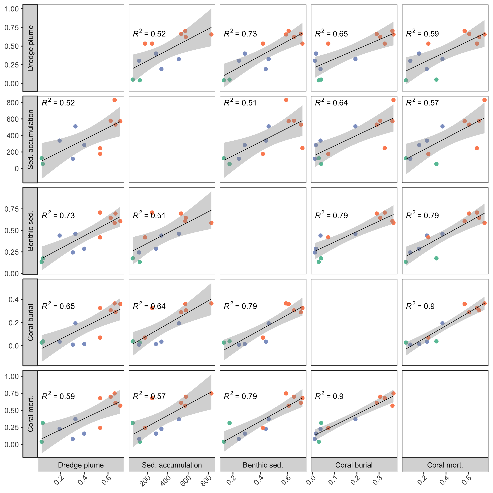
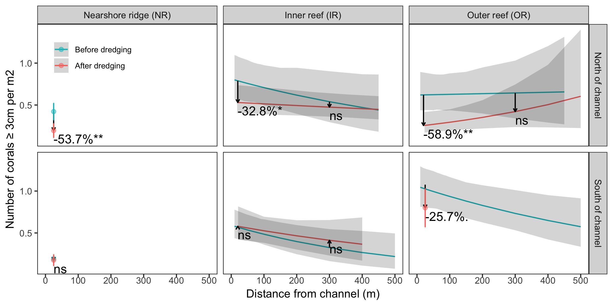

```{r setup, include=FALSE}
knitr::opts_chunk$set(echo = FALSE, warning = FALSE, message = FALSE)

# Load packages
library(tidyverse)
library(lubridate)
library(ggthemes)
library(ggrepel)
library(ggpubr)

# Define start and end of dredging (for plotting)
dredge.start.date <- as.Date("2013-11-20")                # NOAA sediment report April 2016, page 44
dredge.end.date <- as.Date("2015-03-16")                  # DCA report August 2015, page 3

## ggplot theme
theme_custom <- function() {
  theme_bw(base_size = 10, base_family = "Arial") %+replace%
    theme(
      panel.grid.major = element_blank(), 
      panel.grid.minor = element_blank(), 
      panel.background = element_blank(),
      panel.border = element_rect(color = "black", fill = NA),
      legend.background = element_rect(fill = NA, colour = NA),
      axis.text.x = element_text(angle=45, hjust=1, vjust = 1)
    )
}

## ggplot labeller
reefnames <- c(
  HB = "Nearshore ridge (NR)",
  R2 = "Inner reef (IR)",
  R3 = "Outer reef (OR)"
)

dirnames <- c(
  N = "North of channel",
  S = "South of channel"
)

distcatnames <- c(
  `1.25 - 2.5 km` = "1.25 - 2.5 km",
  `< 50 m` = "< 50 m",
  `9.38 km` = "9.38 km"
)

global_labeller <- labeller(
  reef = reefnames,
  dir = dirnames,
  dist_cat = distcatnames,
  .default = label_both
)

# Function to add distance category for each area
add_dist_cat <- function(x) {
  x %>% 
    mutate(dist_cat = factor(case_when(
      channel == "channelside" ~ "< 50 m",
      reef == "HB" & channel == "control" ~ "1.25 - 2.5 km",
      reef %in% c("R2", "R3") & channel == "control" & dir == "S" ~ "1.25 - 2.5 km",
      reef %in% c("R2", "R3") & channel == "control" & dir == "N" ~ "9.38 km")))
}

```

# Study area and design


\  

# Sedimentation on the reef

### *Sediment plume*

\

```{r Fig2, fig.height = 3.74016, fig.width = 7.4801}
load("data/processed/plume.RData")

plume <- plume %>% add_dist_cat()
gamm.fits <- gamm.fits %>% add_dist_cat()
### Plot fitted models
Fig2 <- ggplot(gamm.fits, aes(x = date, y = fit, color = dist_cat)) +
  facet_grid(dir ~ reef, labeller = global_labeller) +
  geom_ribbon(aes(ymin = lci, ymax = uci, linetype = NA), alpha = 0.2) + 
  geom_line(lwd = 1) +
  geom_vline(xintercept = c(dredge.start.date, dredge.end.date), linetype = 3, lwd = 0.25) +
  labs(x = NULL, y = "Probability of dredge plume presence", color = "Distance from channel") +
  geom_jitter(data = filter(plume, reef %in% c("HB", "R2", "R3"), dir %in% c("N", "S")),
             aes(y = as.numeric(plume)), pch = 20, height = 0.02, width = 0, alpha = 0.5) +
  scale_color_manual(values = c("#fc8d62", "#8da0cb", "#66c2a5")) +
  scale_y_continuous(limits = c(0, 1), expand = expand_scale(add = 0.025)) +
  theme_custom() +
  theme(legend.position = c(0.8, 0.36),
        legend.key.size = unit(4, "mm"),
        legend.title = element_text(size = 7),
        legend.text = element_text(size = 6))

ggsave(filename = "figures/Fig2.png", device = "png", width = 190, height = 95, units = "mm")

Fig2
```

**Figure 2. Presence of dredge plume as detected by satellite data.** Smooth lines are GAM fits for each monitoring area (±95% CI), colored according to distance from channel. Points (with jitter added) indicate the presence (1) or absence (0) of the dredge plume on a given date (data not available for all dates). Vertical dotted lines indicate the beginning (2013-11-20) and end (2015-03-16) of dredging operations.

\  

### *Fine sediment deposition*

\  

```{r Fig3, fig.height = 3.74016, fig.width = 7.4801}
# Load sediment trap fitted models (fine sediment deposition rates)
load("data/processed/sedtrap.fine.gamms.RData")
sedtrapmod <- fine.gamms.reef.dir.fits %>%
  rename(date = middate) %>%
  select(reef, dir, channel, date, fit, lci, uci)

fine.gamms.reef.dir.fits <- fine.gamms.reef.dir.fits %>% add_dist_cat()
sedtrap <- sedtrap %>% add_dist_cat()

# Load sediment cover fitted models (from cpce data)
load("data/processed/sedcov.gamms.RData")
sedcovmod <- gamms.reef.dir.fits %>% select(reef, dir, channel, date, fit, lci, uci)

sed <- bind_rows(mutate(sedtrapmod, var = "trap"),
                 mutate(sedcovmod, var = "cov"))

# Calculate correlations between trap and cover data
corrs <- sed %>%
  select(reef, dir, channel, date, var, fit) %>%
  nest(-reef, -dir, -channel) %>%
  mutate(data2 = map(data, ~ spread(.x, var, fit) %>% drop_na(.)),
           mod = map(data2, ~ ccf(.x$cov, .x$trap, lag.max = 120, plot = FALSE)),
           lag = map_dbl(mod, ~ .x$lag[.x$lag>=0][which.max(.x$acf[.x$lag>=0])]),
           cor = map_dbl(mod, ~ .x$acf[.x$lag>=0][which.max(.x$acf[.x$lag>=0])]))

# Add date and fit to map lag and cor values onto ggplot
corrs <- corrs %>%
  mutate(date = as.Date("2013-12-01"), fit = 400)


### Plot fitted models
Fig3 <- ggplot(fine.gamms.reef.dir.fits, aes(x = middate, y = fit, color = dist_cat)) +
  facet_grid(dir ~ reef, labeller = global_labeller) +
  geom_segment(data=sedtrap, 
               aes(x = start, xend = end, y = finerate_mgcm2d, yend = finerate_mgcm2d), lwd = 0.2) +
  geom_ribbon(aes(x = middate, ymin = lci, ymax = uci, linetype = NA), linetype = 0, alpha = 0.2) + 
  geom_line(lwd = 0.5) +
  geom_vline(xintercept = c(dredge.start.date, dredge.end.date), linetype = 3, lwd = 0.25) +
  geom_hline(yintercept = 25, color = "black", lwd = 0.125, linetype = 2) +
  labs(x = NULL, y = "Fine sedimentation rate (mg/cm2/d)",
       color = "Distance from channel") +
  scale_color_manual(values = c("#fc8d62", "#8da0cb", "#66c2a5")) +
  theme_custom() +
  theme(legend.position = c(0.8, 0.36),
        legend.key.size = unit(4, "mm"),
        legend.title = element_text(size = 7),
        legend.text = element_text(size = 6))

ggsave(filename = "figures/Fig3.png", device = "png", width = 190, height = 95, units = "mm")

Fig3
```

**Figure 3. Deposition of fine sediments in each monitoring area during dredging operations.** Horizontal line segments indicate measured rates of fine sediment deposition by each trap over each deployment period. Smooth lines are GAM fits for each monitoring area (±95% CI), colored according to distance from channel. Vertical dotted lines indicate the beginning (2013-11-20) and end (2015-03-16) of dredging operations. The horizontal dashed line indicates a threshold of 25 mg cm^-2^ d^-1^; sediment deposition rates exceeding this threshold over any 30 day window may cause corals severe stress leading to mortality (Nelson et al. 2016). 

\  

### *Total fine sediment deposition*

\  

```{r Fig4, fig.height = 3.74016, fig.width = 7.4801}
load("data/processed/sed_deposited.RData")
fine.depo <- fine.depo %>% add_dist_cat()
## fitted values are in mg / cm2
## to convert to kg per m2, divide by 100


dd <- fine.depo %>% ungroup %>% expand(reef, dir, dist_cat)
dd <- anti_join(dd, fine.depo) %>%
  mutate(int_fit = 0)

ggplot(fine.depo, aes(x = dist_cat, y = int_fit/100, fill = dist_cat)) +
  facet_grid(dir ~ reef, labeller = global_labeller) +
  geom_bar(stat = "identity") +
  geom_errorbar(aes(ymin = int_min/100, ymax = int_max/100), width = 0.25, lwd = 0.25) +
  labs(y = "Kilograms / m2", x = "Distance from channel") +
  scale_fill_manual(values = c("#fc8d62", "#8da0cb", "#66c2a5")) +
  theme_custom() +
  theme(legend.position = 0, axis.text.x = element_text(angle = 0, hjust = 0.5, vjust = 1)) +
  geom_text(data = dd, aes(label = "n/a"), vjust = "bottom")


ggsave(filename = "figures/Fig4.png", device = "png", width = 190, height = 95, units = "mm")
```

**Figure 4. Total amount of fine sediments deposited in each monitoring area during dredging operations.** Bars indicate the sum of fitted daily fine sediment deposition rates between 2013-11-20 and 2015-03-16 (see Fig. S1) for each monitoring area (± 95% CI). Bars are colored corresponding to distance from channel, and empty spaces indicate areas that were not monitored.

\  

### *Sediment cover*

\  

```{r Fig5, fig.height = 3.74016, fig.width = 7.4801}
sed <- sed %>% add_dist_cat()
sand.summ <- sand.summ %>% add_dist_cat()
### Plot only sand cover (CPCE)
Fig5 <- ggplot(filter(sed, var == "cov"), aes(x = date, y = fit, color = dist_cat)) +
  facet_grid(dir ~ reef, labeller = global_labeller) +
  geom_point(data = sand.summ, aes(y = meanpropsand), alpha = 0.4, size = 0.75) +
  geom_ribbon(aes(ymin = lci, ymax = uci, linetype = NA), linetype = 0, alpha = 0.2) + 
  geom_line(lwd = 0.5) +
  geom_vline(xintercept = c(dredge.start.date, dredge.end.date), linetype = 3, lwd = 0.25) +
  labs(x = NULL, y = "Percent sediment cover",
       color = "Distance from channel") +
  scale_x_date(limits = c(as.Date("2013-10-20"), as.Date("2015-07-16"))) +
  scale_y_continuous(limits = c(0, 1), labels = scales::percent) +
  scale_color_manual(values = c("#fc8d62", "#8da0cb", "#66c2a5")) +
  theme_custom() +
  theme(legend.position = c(0.8, 0.36),
        legend.key.size = unit(4, "mm"),
        legend.title = element_text(size = 7),
        legend.text = element_text(size = 6))

ggsave(filename = "figures/Fig5.png", plot = Fig5, device = "png", width = 190, height = 95, units = "mm")

Fig5
```

**Figure 5. Percent sediment cover at each monitoring area during dredging operations.** Points indicate the mean percent sediment cover for each transect measured by CPCe analysis, and smooth lines show GAMM fits for each monitoring area (±84% CI). Fitted lines are colored by distance from channel. Vertical dotted lines indicate the beginning (2013-11-20) and end (2015-03-16) of dredging operations.

\  

```{r FIGS1, fig.height = 3.74016, fig.width = 7.4801}
figS1 <- Fig5 + scale_x_date(limits = NULL)
ggsave(filename = "figures/FigS1.png", plot = figS1, device = "png", width = 190, height = 95, units = "mm")
figS1
```

**Figure S1. Percent sediment cover at each monitoring area during dredging operations.** Points indicate the mean percent sediment cover for each transect measured by CPCe analysis, and smooth lines show GAMM fits for each monitoring area (±84% CI). Fitted lines are colored by distance from channel. Vertical dotted lines indicate the beginning (2013-11-20) and end (2015-03-16) of dredging operations.

*Figure S1 is the same as Figure 5 with the time axis extended to show 2016 data points.*

\  

```{r FIGS2, fig.height = 3.74016, fig.width = 10}
sedtrapmod <- sedtrapmod %>% add_dist_cat()
sedcovmod <- sedcovmod %>% add_dist_cat()
corrs <- corrs %>% add_dist_cat()
# Plot both sediment trap and cpce data on same panel for each area
ggplot(data = droplevels(sedtrapmod), mapping = aes(x = date, y = fit, color = dist_cat)) + 
  facet_grid(dir ~ reef + dist_cat, scales = "free", drop = TRUE, labeller = global_labeller) +
  geom_line(data = sedtrapmod) +
  geom_line(data = sedcovmod, aes(y = fit * 400), linetype = 2) +
  scale_y_continuous("Fine sedimentation rate (mg/cm2/day)",
                     sec.axis = sec_axis(~ (.) / 400, name = "Percent sediment cover", labels = scales::percent)) +
  geom_text(data = corrs, aes(label = paste0("cor =", round(cor, 2)), hjust = "left"), size = 2) +
  geom_text(data = corrs, aes(y = fit - 50, label = paste0("lag =", lag), hjust = "left"), size = 2) +
  scale_color_manual(values = c("#fc8d62", "#8da0cb", "#66c2a5")) +
  geom_vline(xintercept = c(dredge.start.date, dredge.end.date), linetype = 3, lwd = 0.25) +
  theme_custom() +
  theme(legend.position = 0) +
  labs(x = NULL)

ggsave(filename = "figures/FigS2.png", device = "png", width = 190, height = 95, units = "mm")

#median(corrs$cor)
#median(corrs$lag)
```

**Figure S2. Correlation between fine sediment deposition rates and benthic sediment cover during dredging operations at each monitoring area.** The left y-axis and solid lines correspond to the fine sediment deposition rate (see Fig. S1), while the right y-axis and dotted lines correspond to percent sediment cover (see Fig. 2), with separate panels for each monitoring area. The coefficient of correlation between the two time series is displayed in each panel, along with the lag time (of cover following deposition) for which the highest correlation is observed (up to 120 days). Colors correspond to distance from channel. Blank panels are combinations of reef, direction, and distance for which monitoring data do not exist. Vertical dotted lines indicate the beginning (2013-11-20) and end (2015-03-16) of dredging operations.

*Figure S2 presents the same data from Figures 3 and 5, analyzed and visualized together to show their correlation.*

\  

# Impacts on tagged corals

### *Coral burial*

\  

```{r Fig6, fig.height = 3.74016, fig.width = 7.4801}
load("data/processed/sedstress_gamms.RData")

gamms2.fitted <- gamms2.fitted %>% add_dist_cat()

sedstress.summ2 <- sedstress.summ2 %>% add_dist_cat()

# Plot
Fig6 <- ggplot(gamms2.fitted, aes(x = date, y = fit, color = dist_cat)) +
  facet_grid(dir ~ reef, labeller = global_labeller) +
  geom_point(data = sedstress.summ2, aes(y = prop), alpha = 0.3, size = 0.75) +
  geom_ribbon(aes(ymin = lci, ymax = uci, linetype = NA), linetype = 0, alpha = 0.2) +
  geom_line(lwd = 0.5) +
  geom_vline(xintercept = c(dredge.start.date, dredge.end.date), linetype = 3, lwd = 0.25) +
  scale_color_manual(values = c("#fc8d62", "#8da0cb", "#66c2a5")) +
  labs(x = NULL, y = "Probability of partial or complete burial",
       color = "Distance from channel") +
  scale_x_date(limits = c(as.Date("2013-10-20"), as.Date("2015-07-01"))) +
  theme_custom() +
  theme(legend.position = c(0.8, 0.36), # c(0,0) bottom left, c(1,1) top-right.
        legend.background = element_rect(fill = NA, colour = NA),
        legend.key.size = unit(4, "mm"),
        legend.title = element_text(size = 7),
        legend.text = element_text(size = 6))

ggsave(filename = "figures/Fig6.png", plot = Fig6, device = "png", width = 190, height = 95, units = "mm")

Fig6
```

**Figure 6. Probability of partial or complete coral burial by sediments in each monitoring area during dredging operations.** Points indicate the proportion of living tagged corals in each monitoring area observed on a given date with the condition codes PBUR (partial burial) or BUR (complete burial). Lines represent GAMM fits for each monitoring area (±84% CI) colored by distance from channel. Vertical dotted lines indicate the beginning (2013-11-20) and end (2015-03-16) of dredging operations.

\  

```{r FIGS3, fig.height = 3.74016, fig.width = 7.4801}
figS3 <- Fig6 + scale_x_date(limits = NULL)
ggsave(filename = "figures/FigS3.png", plot = figS3, device = "png", width = 190, height = 95, units = "mm")

figS3
```

**Figure S3. Probability of partial or complete coral burial by sediments in each monitoring area during dredging operations.** Points indicate the proportion of living tagged corals in each monitoring area observed on a given date with the condition codes PBUR (partial burial) or BUR (complete burial). Lines represent GAMM fits for each monitoring area (±84% CI) colored by distance from channel. Vertical dotted lines indicate the beginning (2013-11-20) and end (2015-03-16) of dredging operations.

*Figure S3 is the same as Figure 6, but with the time axis extended to show the 2016 data points.*

\  

### *Partial mortality*

\  

```{r FIG7, fig.height = 3.74016, fig.width = 7.4801}
load("data/processed/pm.lsm.RData")

pm.lsm1 <- summary(pm.lsm1) %>% add_dist_cat()

dd <- pm.lsm1 %>% ungroup %>% expand(reef, dir, dist_cat)
dd <- anti_join(dd, pm.lsm1) %>%
  mutate(prob = 0)

# Plot partial mortality prevalence
ggplot(pm.lsm1, aes(x = dist_cat, y = prob, fill = dist_cat)) + 
  facet_grid(dir ~ reef, labeller = global_labeller) +
  geom_bar(stat = "identity") +
  geom_errorbar(aes(ymin = asymp.LCL, ymax = asymp.UCL), width = 0.2, lwd = 0.2) +
  #geom_text(data = data.frame(summary(pm.lsm1.sig)), inherit.aes = FALSE,
  #          aes(x = 1.5, y = 0.8, label = ifelse(p.value < 0.05, "*", NA)), cex = 10) +
  scale_y_continuous(limits = c(0, 1)) +
  scale_fill_manual(values = c("#fc8d62", "#8da0cb", "#66c2a5")) +
  theme_custom() +
  theme(legend.position = "none",
        axis.text.x = element_text(angle=0, hjust=0.5, vjust = 1)) +
  labs(x = "Distance from channel", y = "Probability of partial mortality due to sediment") +
  geom_text(data = dd, aes(label = "n/a"), vjust = "bottom")

ggsave(filename = "figures/Fig7.png", device = "png", width = 190, height = 95, units = "mm")

#pm.lsm1
```

**Figure 7. Coral partial mortality due to sedimentation in each monitoring area throughout dredging operations.** Bars indicate the predicted probability (±95% CI) of tagged corals being observed with the condition code PM (partial mortality due to sedimentation) at any point through March 2015 (the final month of dredging operations). Bar colors correspond to distance from channel, and empty spaces indicate areas that were not monitored.

\  

```{r old_Fig7, include = FALSE, eval = FALSE, fig.height = 5, fig.width = 5}
# Load sediment deposition data (see Rmd/sediment_trap.Rmd)
load("data/processed/sed_deposited.RData")

# Join partial mortality results with fine sediment deposition data
finesed.pm <- full_join(fine.depo, pm.lsm1)
finesed.pm <- ungroup(finesed.pm)

# Fit linear model with weights inverse to standard error of y-axis
lmod <- lm(prob ~ int_fit, data = finesed.pm, weights = 1 / SE)
lpred <- data.frame(int_fit = finesed.pm$int_fit, prob = predict(lmod, finesed.pm))
#summary(lmod)$r.squared
#summary(lmod)$coefficients[,4][2]

#drm1 <- drm(prob ~ int_fit, data = finesed.pm, fct = W2.4())
#drm1
#plot(drm1)

# Fit a Weibull type 2 curve using 1/SE as weights
nls1 <- nls(prob ~ c + (d - c) * (1 - exp(-exp(b * (log(int_fit) - log(e))))), data = finesed.pm,
            weights = 1 / SE,
            start = list(b = 2.3, c = 0.18, d = 0.8, e = 58790))
nls1pred <- data.frame(int_fit = min(finesed.pm$int_fit):max(finesed.pm$int_fit))
nls1pred$prob <-  predict(nls1, newdata = nls1pred)

# residSS
rSS <- sum(abs(fitted(nls1) - finesed.pm$prob)^2)
# totSS
tSS <- sum((finesed.pm$prob - mean(finesed.pm$prob))^2)
# proportion explained by model
#(tSS - rSS) / tSS
#1 - rSS / tSS

# without R3N (rows 9 and 10)
# residSS
rSS <- sum(abs(fitted(nls1)[-(9:10)] - finesed.pm$prob[-(9:10)])^2)
# totSS
tSS <- sum((finesed.pm$prob[-(9:10)] - mean(finesed.pm$prob)[-(9:10)])^2)
# proportion explained by model
#(tSS - rSS) / tSS

# Create new labels for each monitoring area for plot
finesed.pm <- finesed.pm %>%
  mutate(reef2 = case_when(reef == "HB" ~ "IR", reef == "R2" ~ "MR", reef == "R3" ~ "OR"),
           lab = paste(dir, reef2, sep = ""))
# Plot
set.seed(342343)
ggplot(finesed.pm, aes(x = int_fit/100, y = prob)) + 
  geom_errorbar(aes(ymin = prob - SE, ymax = prob + SE), lwd = 0.2) +
  geom_errorbarh(aes(xmin = int_min/100, xmax = int_max/100), lwd = 0.2) +
  geom_point(aes(color = dist_cat)) +
  geom_line(data = nls1pred, linetype = 2) +
  #geom_line(data = lpred, linetype = 2) +
  #geom_smooth(method='lm') +
  labs(x = "Total fine sediment deposited (kg / m2)",
       y = "Probability of partial mortality", color = "Distance from channel") +
  geom_text_repel(aes(label = lab), size = 2) +
  scale_color_manual(values = c("#fc8d62", "#8da0cb", "#66c2a5")) +
  #annotate("text", x = 350, y = 0.1, label = as.character(expression(R^{2}*" = 0.74")), parse = TRUE) +
  #annotate("text", x = 350, y = 0.05, label = "p = 0.0003") +
  theme_custom() +
  theme(legend.position = c(0.8, 0.2),
        legend.key.size = unit(4, "mm"),
        legend.title = element_text(size = 7),
        legend.text = element_text(size = 6),
        axis.text.x = element_text(angle=0, hjust=0.5, vjust = 1))


ggsave(filename = "figures/Fig7.png", device = "png", width = 90, height = 85, units = "mm")

#**Figure 7. Relationship between total fine sediment deposition and coral partial mortality during dredging operations.** Points indicate, for each #monitoring area, the total amount of fine sediments deposited during dredging (±95% CI; see Fig. 3) on the x-axis, and the probability of partial #mortality (±95% CI; see Fig. S3) on the y-axis. Points are labeled corresponding to reef region (SIR = sourthern inner reef, NIR = northern inner reef, #SMR = southern middle reef, NMR = northern middle reef, SOR = southern outer reef, NOR = northern outer reef) and colored corresponding to distance from #channel. The fitted dose-response curve follows a four parameter type two Weibull function weighted inversely by the SE of partial mortality estimates.

```


\  

### *Total mortality*

\  

```{r FIGS4, fig.height = 3.74016, fig.width = 7.4801}
load("data/processed/tm.lsm.RData")

dead.lsm4 <- summary(dead.lsm4) %>% add_dist_cat()
#dead.lsm4

dd <- dead.lsm4 %>% ungroup %>% expand(reef, dir, dist_cat)
dd <- anti_join(dd, dead.lsm4) %>%
  mutate(prob = 0)

# Plot total mortality prevalence
ggplot(dead.lsm4, aes(x = dist_cat, y = prob, fill = dist_cat)) + 
  facet_grid(dir ~ reef, labeller = global_labeller) +
  geom_bar(stat = "identity") +
  geom_errorbar(aes(ymin = asymp.LCL, ymax = asymp.UCL), width = 0.2, lwd = 0.3) +
  #geom_text(data = data.frame(summary(dead.lsm4.sig)), inherit.aes = FALSE,
  #          aes(x = 1.5, y = 0.8, label = ifelse(p.value < 0.05, "*", NA)), cex = 10) +
  scale_y_continuous(limits = c(0, 1)) +
  scale_fill_manual(values = c("#fc8d62", "#8da0cb", "#66c2a5")) +
  theme_custom() +
  theme(legend.position = "none",
        axis.text.x = element_text(angle=0, hjust=0.5, vjust = 1)) +
  labs(x = "Distance from channel", y = "Probability of total mortality (non-disease)") +
  geom_text(data = dd, aes(label = "n/a"), vjust = "bottom")

ggsave(filename = "figures/FigS4.png", device = "png", width = 190, height = 95, units = "mm")
```

**Figure S4. Total mortality of non-disease-susceptible coral species in each monitoring area throughout dredging operations.** Bars indicate the predicted probability (±95% CI) of tagged corals being observed with the condition code PM (partial mortality due to sedimentation) at any point through March 2015 (the final month of dredging operations). Bar colors correspond to distance from channel, and empty spaces indicate areas that were not monitored.

\  

# *Correlations among metrics*

\  

```{r Fig8, fig.height = 7.4801, fig.height = 7.4801}
# Plume presence
load("data/processed/plume.RData")
plume <- plume.summ %>%
  mutate(plumeprob = pct) %>%
  select(reef, dir, channel, plumeprob)

# Sediment deposition
load("data/processed/sed_deposited.RData")
depo <- fine.depo
depo <- depo %>%
  rename(int_finedepo = int_fit) %>%
  select(reef, dir, channel, int_finedepo) %>%
  mutate(int_finedepo = int_finedepo / 100)

# Sediment cover
load("data/processed/sedcov.gamms.RData")
# FILTER TO INCLUDE DATES FOR WHICH FITTED VALUES EXIST FOR ALL SITES (ONLY FULLY COMPARABLE TIME INTERVALS)....
dates1 <- gamms.reef.dir.fits %>%
  filter(date > dredge.start.date, date < dredge.end.date) %>%
  group_by(reef, dir, channel) %>%
  summarise(d = list(unique(as.Date(date))))
dates_all <- zoo::as.Date.numeric(Reduce(intersect, dates1$d))
sandcov <- gamms.reef.dir.fits %>%
  filter(date %in% dates_all) %>%
  group_by(reef, dir, channel) %>%
  summarise(mean_sandcov = mean(fit)) %>%
  select(reef, dir, channel, mean_sandcov)

# Sediment stress / coral burial
load("data/processed/sedstress_gamms.RData")
# FILTER TO INCLUDE DATES FOR WHICH FITTED VALUES EXIST FOR ALL SITES (ONLY FULLY COMPARABLE TIME INTERVALS)....
dates2 <- gamms2.fitted %>%
  filter(date > dredge.start.date, date < dredge.end.date) %>%
  group_by(reef, dir, channel) %>%
  summarise(d = list(unique(as.Date(date))))
dates_all2 <- zoo::as.Date.numeric(Reduce(intersect, dates2$d))
stress <- gamms2.fitted %>%
  group_by(reef, dir, channel) %>%
  filter(date %in% dates_all2) %>%
  summarise(mean_sedstress = mean(fit)) %>%
  select(reef, dir, channel, mean_sedstress)

# Partial mortality
load("data/processed/pm.lsm.RData")
pmort <- as_tibble(summary(pm.lsm1)) %>%
  rename(pmort = prob) %>%
  select(reef, dir, channel, pmort)


# Join all response variables together into df and add site names/labels
df <- list(plume, depo, sandcov, stress, pmort) %>% 
  reduce(left_join, by = c("reef", "dir", "channel")) %>% 
  ungroup()

df <- df %>% add_dist_cat() %>%
  mutate(reef2 = case_when(reef == "HB" ~ "IR", reef == "R2" ~ "MR", reef == "R3" ~ "OR"),
           lab = paste(dir, reef2, sep = ""))

df <- df %>%
  mutate(dist = case_when(reef == "HB" & dir == "N" & channel == "channelside" ~ 25,
                          reef == "HB" & dir == "N" & channel == "control" ~ 2350,
                          reef == "HB" & dir == "S" & channel == "channelside" ~ 20,
                          reef == "HB" & dir == "S" & channel == "control" ~ 1650,
                          reef == "R2" & dir == "N" & channel == "channelside" ~ 23,
                          reef == "R2" & dir == "N" & channel == "control" ~ 9380,
                          reef == "R2" & dir == "S" & channel == "channelside" ~ 22,
                          reef == "R2" & dir == "S" & channel == "control" ~ 1270,
                          reef == "R3" & dir == "N" & channel == "channelside" ~ 23,
                          reef == "R3" & dir == "N" & channel == "control" ~ 9380,
                          reef == "R3" & dir == "S" & channel == "channelside" ~ 30,
                          reef == "R3" & dir == "S" & channel == "control" ~ 1300))


# PLOT CORRELATIONS USING GGPLOT
gatherpairs <- function(data, ..., 
                        xkey = '.xkey', xvalue = '.xvalue',
                        ykey = '.ykey', yvalue = '.yvalue',
                        na.rm = FALSE, convert = FALSE, factor_key = FALSE) {
  vars <- quos(...)
  xkey <- enquo(xkey)
  xvalue <- enquo(xvalue)
  ykey <- enquo(ykey)
  yvalue <- enquo(yvalue)

  data %>% {
    cbind(gather(., key = !!xkey, value = !!xvalue, !!!vars,
                 na.rm = na.rm, convert = convert, factor_key = factor_key),
          select(., !!!vars)) 
  } %>% gather(., key = !!ykey, value = !!yvalue, !!!vars,
               na.rm = na.rm, convert = convert, factor_key = factor_key)
}

keynames <- c(plumeprob = "Dredge plume",
              mean_sedstress = "Coral burial",
              mean_sandcov = "Benthic sed.",
              int_finedepo = "Sed. deposition",
              pmort = "Coral mort.")
key_labeller <- labeller(
  .xkey = keynames, .ykey = keynames, dist_cat = distcatnames,
  .default = label_both
)

Fig8 <- df %>% gatherpairs(plumeprob, int_finedepo, mean_sandcov, mean_sedstress, pmort) %>%
  filter(.xkey != .ykey) %>%
  mutate(.xkey = factor(.xkey, levels = c("plumeprob", "int_finedepo", "mean_sandcov", "mean_sedstress", "pmort")),
         .ykey = factor(.ykey, levels = levels(.xkey))) %>%
  ggplot(., aes(x = .xvalue, y = .yvalue)) +
      facet_grid(.ykey ~ .xkey, scales = "free", switch = "both", labeller = key_labeller) +
      geom_point(aes(color = dist_cat)) + 
      geom_smooth(method = 'lm', se = TRUE, color = "black", lwd = 0.25) +
      stat_cor(aes(label = ..rr.label..), size = 3, label.y.npc = 1, label.x.npc = 0) +
      #geom_text_repel(aes(label = lab), size = 2) +
      scale_color_manual(values = c("#fc8d62", "#8da0cb", "#66c2a5")) +
      #scale_y_continuous(limits = c(NA, NA), expand = expand_scale(mult = c(0, 0.05))) +
      theme_custom() + 
      theme(legend.position="none") +
      labs(x = NULL, y = NULL)

ggsave(filename = "figures/Fig8.png", device = "png", width = 190, height = 190, units = "mm")

Fig8
```

**Figure 8. Correlations among multiple metrics measured across monitoring areas.** Points represent monitoring areas (n = 12) colored by distance from channel (green = <50 m; blue = 1.25 - 2.5 km; red = 9.38 km). Metrics are as follows: Dredge plume = proportion of days dredge plume present (see Fig. 2); Sed. deposition = total fine sediment deposition during project (kg / m2; see Fig. 5); Benthic sed. = mean daily proportion benthic sediment cover during project (see Fig. 4); Coral burial = mean daily probability of coral burial during project (see Fig. 6); Coral mort. = probability of partial mortality among tagged corals (see Fig. 7). Metrics derived from time series (e.g., Benthic sed., Coral burial) only include dates for which data were available from all monitoring areas. Each panel displays the correlation coefficient (*R*) for the two metrics, a linear regression, and p-value for the null hypothesis that the slope is equal to zero.

\  

# *Impact predictions based on dredge plumes*

\ 

```{r Fig9, fig.height = 3.74016, fig.width = 7.4801}

```

**Figure 9. Predicted magnitude and extend of dredging impacts based on dredge plume occurrence.** Lines indicate the mean frequency of dredge plume presence along linear transects from 15km north to 15km south of the channel centered at the NR, IR, and OR based on satellite imagery. Axes on the right show predicted impacts based on linear transformations of dredge plume presence according to the models in Fig. 8.

\  

# Impacts on reef habitat

\  

### *Sediment depth*

\  

```{r Fig10, fig.height = 3.74016, fig.width = 7.4801}
load("data/processed/sdepthmod.RData")

LR <- LR %>%
  add_row(reef = "HB", dir = "S") %>%
  add_row(reef = "HB", dir = "N") %>%
  mutate(reef = factor(reef, levels = c("HB", "R2", "R3")))

ggplot(data = LR, mapping = aes(x = dist, y = sdepth_cm)) +
  facet_grid(dir ~ reef, labeller = global_labeller) + 
  geom_jitter(width = 10, size = 0.5, alpha = 0.5) +
  coord_cartesian(xlim = c(0, 500)) +
  geom_line(data = filter(resdf, !(reef == "R3" & dir == "S")), 
            aes(x = dist, y = fit, linetype = pct_reef_covered)) +
  labs(x = "Distance from channel (m)", y = "Sediment depth (cm)") +
  theme_custom() +
  scale_linetype_manual(name = "% of area",
                        labels = c(1, 10, 25, 50), values = c(3,4,2,1)) +
  theme(legend.position = c (0.25, 0.85),
        legend.key.size = unit(3, "mm"),
        legend.key.width = unit(10, "mm"),
        axis.text.x = element_text(angle=0, hjust=0.5, vjust = 1))

ggsave(filename = "figures/Fig10.png", device = "png", width = 190, height = 95, units = "mm")
```

**Figure 10. Depth of sediments in relation to channel measured ~2 years after dredging operations.** Dots represent individual sediment depth measurements along transects, jittered around the distance from the center of the transect to the channel in each monitoring region (no data available for the inner reef). Lines represent quantile regressions across transects as a function of log(distance from channel), e.g., the percent of reef area with sediments measuring at least a given depth.

\  

### *Sediment cover before and after dredging*

\  

```{r FIGS5, fig.height = 3.74016, fig.width = 7.4801}
load("data/processed/cpce.RData")
cpce <- cpce_sub
# Count sand vs. not sand, and create numeric weeks column
cpce <- cpce %>%
  mutate(sumpts = rowSums(select_if(., is.integer)),     # sum counts of all categories
         notsand = as.integer(sumpts - sand_sa)) %>%     # sum counts of not sand
  mutate_if(is.character, as.factor) %>%
  mutate(weekn = (date - min(date)) / dweeks(1),  # create numeric weeks column
         dayn  = as.numeric(date - min(date)))

# Show percent sand at each site for TRUE baseline (must be before Nov. 20, 2013) and late 2016
ba <- cpce %>%
  filter(date < as.Date("2013-11-20") | date > as.Date("2016-01-01")) %>%
  group_by(reef, dir, channel, site, date, transect) %>%
  summarize(propsand = mean(sand_sa / sumpts)) %>%
  group_by(reef, dir, channel, site, year = factor(year(date))) %>%
  summarize(meanpropsand = mean(propsand),
            sd = sd(propsand))

ba %>%
  filter(site %in% c("R2N1", "R2S1", "R2SC1")) %>%
  ggplot(aes(x = year, y = meanpropsand)) +
  facet_wrap(~ site) +
  geom_bar(stat = "identity") +
  geom_errorbar(aes(ymin = meanpropsand - sd, ymax = meanpropsand + sd), 
                width = 0.5, lwd = 0.3) +
  theme(legend.position = c(0.75, 0.075)) +
  theme_custom() +
  labs(x = "", y = "Percent sediment cover") +
  scale_y_continuous(labels = scales::percent) +
  theme(legend.position = 0,
        legend.key.size = unit(4, "mm"))

ggsave(filename = "figures/FigS5.png", device = "png", width = 90, height = 65, units = "mm")
```

**Figure S5. Percent cover before (2013) and after dredging (2016) at the three permanent monitoring sites for which both before and after data were collected.** Bars indicate the mean percent sediment based on CPCe analysis, and error bars represent standard deviation.

\  

### *Coral density*

\  

```{r Fig11, fig.height = 3.74016, fig.width = 7.4801}
load("data/processed/large.dens.mod.RData"); large.dens <- newdata_1; large.anno <- anno; large.lsm <- lsm; rm(anno, newdata_1, lsm)

# PLOT ALL RESULTS FOR LARGE CORALS
ggplot(data = large.dens, aes(x = dist, y = fit, color = timepoint)) +
  facet_grid(dir ~ reef, scales = "free_x", labeller = global_labeller) +
  geom_line() +
  scale_x_continuous(limits = c(0, 500)) +
  geom_ribbon(aes(ymin = lci, ymax = uci, linetype = NA), linetype = 0, alpha = 0.2) +
  geom_errorbar(data = large.lsm, aes(x = dist, y = rate, ymin = asymp.LCL, ymax = asymp.UCL)) +
  geom_point(data = large.lsm, aes(x = dist, y = rate), alpha = 0.5, size = 0.75) +
  geom_segment(data = large.anno, inherit.aes = FALSE, lwd = 0.2,
               aes(x = dist, y = `pre-2014`, xend = dist, yend = `post-2014`), 
               arrow = arrow(length = unit(0.03, "npc"))) +
  geom_text(data = large.anno, inherit.aes = FALSE, hjust = "left", size = 2,
            aes(x = dist, y = `post-2014` - 0.1, label = paste0(rel2, sig2))) +
  labs(x = "Distance from channel (m)", y = "Number of corals ≥ 3cm per m2", color = "") +
  scale_color_manual(labels = c("Before dredging", "After dredging"), values = c("#00BFC4", "#F8766D")) +
  coord_cartesian(ylim = c(0, 1.7)) +
  theme_custom() +
  theme(legend.position = c(0.1, 0.9),
        legend.key.size = unit(5, "mm"),
        legend.text = element_text(size = 7),
        axis.text.x = element_text(angle=0, hjust=0.5, vjust = 1))

ggsave(filename = "figures/Fig11.png", device = "png", width = 190, height = 95, units = "mm")


# Calculate total number of corals lost per square meter within threshold of 
#large.dens %>%
#  select(reef, dir, dist, timepoint, fit) %>%
#  spread(timepoint, fit) %>%
#  mutate(diff = `post-2014` - `pre-2014`) %>%
#  filter(diff < 0) %>%
#  group_by(reef, dir) %>%
#  summarise(thresh_dist = max(dist),
#            total_diff = sum(diff))

#(77.8 * 700) + (29.7 * 700) + (161 * 100)
```

**Figure 11. Density of corals ≥3cm within 500m from the channel in each monitoring region before and after dredging operations.** Data 'before' dredging were collected in 2010 and 2013, and data after dredging were collected in 2016-2017. GLMM fits are shown as lines for the regions and times in which data were collected at >2 points beyond 50m, and otherwise as points including only data from within 50m of the channel. Shaded regions and error bars represent 84% CI's. Text annotations indicate the results of tests for differences between timepoints at 20m and 300m from the channel (*** = p < 0.0001; ns = not significantly different).

\  

```{r FigS6, fig.height = 3.74016, fig.width = 7.4801}

```

**Figure S6. Density of non-disease-susceptible corals ≥3cm within 500m from the channel in each monitoring region before and after dredging operations.** Data 'before' dredging were collected in 2010 and 2013, and data after dredging were collected in 2016-2017. GLMM fits are shown as lines for the regions and times in which data were collected at >2 points beyond 50m, and otherwise as points including only data from within 50m of the channel. Shaded regions and error bars represent 84% CI's. Text annotations indicate the results of tests for differences between timepoints at 20m and 300m from the channel (*** = p < 0.0001; ns = not significantly different).

\  

```{r FIG12, fig.height = 3.74016, fig.width = 7.4801}
load("data/processed/small.dens.mod.RData"); small.dens <- newdata_2; small.anno <- anno; small.lsm <- lsm 
rm(anno, newdata_2, lsm)

# Plot results
ggplot(data = small.dens, aes(x = dist, y = fit, color = timepoint)) +
  facet_grid(dir ~ reef, scales = "free_x", labeller = global_labeller) +
  geom_line() +
  geom_ribbon(aes(ymin = lci, ymax = uci, linetype = NA), linetype = 0, alpha = 0.2) +
  geom_segment(data = small.anno, inherit.aes = FALSE, lwd = 0.2,
               aes(x = dist, y = `2010 baseline`, xend = dist, yend = `2016/2017 cross-site surveys`), 
               arrow = arrow(length = unit(0.03, "npc"))) +
  geom_text(data = small.anno, inherit.aes = FALSE, hjust = "left", size = 2,
            aes(x = dist + 10, y = `2016/2017 cross-site surveys` + 0.2, 
                label = paste0(rel2, sig2))) +
  labs(x = "Distance from channel (m)", y = "Number of small corals (1-2 cm) per m2", color = "") +
  geom_point(data = small.lsm, aes(x = dist, y = rate), alpha = 0.5) +
  geom_errorbar(data = small.lsm, aes(x = dist, y = rate, ymin = asymp.LCL, ymax = asymp.UCL)) +
  coord_cartesian(ylim = c(0, 1.8), xlim = c(0, 500)) +
  theme_custom() +
  theme(legend.position = c(0.1, 0.9),
        legend.key.size = unit(5, "mm"),
        legend.text = element_text(size = 7),
        axis.text.x = element_text(angle=0, hjust=0.5, vjust = 1)) +
  scale_color_manual(labels = c("Before dredging", "After dredging"), values = c("#00BFC4", "#F8766D"))
  
ggsave(filename = "figures/Fig12.png", device = "png", width = 190, height = 95, units = "mm")
```

**Figure 12. Density of small corals (1-2cm) within 500m from the channel in each monitoring region before and after dredging operations.** Data 'before' dredging were collected in 2010, and data after dredging were collected in 2016-2017. GLMM fits are shown as lines for the regions and times in which data were collected at >2 points beyond 50m. Shaded regions and error bars represent 84% CI's. Text annotations indicate the results of tests for differences between timepoints at 20m and 300m from the channel (. = p < 0.1; * = p < 0.05; ns = not significantly different).

\  

```{r FigS7, fig.height = 3.74016, fig.width = 7.4801}
knitr::include_graphics("../figures/FigS7.png")
```

**Figure S7. Density of non-disease-susceptible small corals (1-2cm) within 500m from the channel in each monitoring region before and after dredging operations.** Data 'before' dredging were collected in 2010, and data after dredging were collected in 2016-2017. GLMM fits are shown as lines for the regions and times in which data were collected at >2 points beyond 50m. Shaded regions and error bars represent 84% CI's. Text annotations indicate the results of tests for differences between timepoints at 20m and 300m from the channel (. = p < 0.1; * = p < 0.05; ns = not significantly different).

\  

### *Coral size-frequency*

\  

```{r FigS8, fig.height = 3.74016, fig.width = 7.4801}
load("data/processed/sizefreq.RData")

df <- df %>%
  mutate(reef = factor(reef, levels = c("HB", "R2", "R3")))

kwtest <- kwtest %>%
  add_row(reef = "HB", dir = "N", data = NA, kw = NA, p = NA, x = 15, y = 0.1) %>%
  add_row(reef = "HB", dir = "S", data = NA, kw = NA, p = NA, x = 15, y = 0.1)

# Plot size frequency distributions and annotate with KW test p values
ggplot(df, aes(x = diameter, fill = year <= 2010)) + 
  geom_histogram(aes(y = ..density..),    # Scales each histogram so the total area = 1
                 position = "identity", binwidth = 1, alpha = 0.3) +
  facet_grid(dir ~ reef, labeller = global_labeller, drop = FALSE) +
  labs(x = "Coral diameter (cm)", y = "Proportion of individuals", fill = "") +
  xlim(0, 20) +
  geom_text(data = kwtest, aes(fill = NULL, x = x, y = y, 
            label = paste("p =", formatC(p, format = "e", digits = 2))), size = 2) +
  theme_custom() +
  theme(legend.position = c(0.1, 0.9),
        legend.key.size = unit(5, "mm"),
        legend.text = element_text(size = 8),
        axis.text.x = element_text(angle=0, hjust=0.5, vjust = 1)) +
  scale_fill_manual(labels = c("After dredging", "Before dredging"), values = c("#F8766D", "#00BFC4"))

ggsave(filename = "figures/FigS8.png", device = "png", width = 190, height = 95, units = "mm")
```

**Figure S8. Size frequency distribution of corals before and after dredging.** For the northern and southern inner and outer reefs, histograms show the relative proportion of corals within 100m of the channel with a given maximum diameter. P-values on each panel are based on a Kruskal-Wallis test for a difference in mean diameter between the two timepoints.

\  

```{r FigS8_alternative, fig.height = 3.74016, fig.width = 7.4801}
# Plot histogram with absolute density instead of relative proportion
# get total area per reef/dir/timepoint
areas <- df %>%
  distinct(reef, dir, timepoint, site, site2, dist, year, date, transect, transect_area_m2) %>%
  group_by(reef, dir, timepoint) %>%
  summarise(total_area_surveyed = sum(transect_area_m2))

counts <- df %>%
  group_by(reef, dir, timepoint, diameter = ceiling(diameter)) %>%
  summarise(total_count = sum(count))


df2 <- left_join(counts, areas) %>%
  mutate(dens = total_count / total_area_surveyed)

ggplot(df2, aes(x = diameter, fill = timepoint)) + 
  geom_bar(aes(y = dens, group = timepoint), stat = "identity", alpha = 0.3, position = "identity", width = 1) +
  facet_grid(dir ~ reef, labeller = global_labeller, drop = FALSE) +
  labs(x = "Coral diameter (cm)", y = "Number of individuals / m2", fill = "") +
  xlim(0, 40) +
  geom_text(data = kwtest, aes(fill = NULL, x = x, y = y, 
            label = paste("p =", formatC(p, format = "e", digits = 2))), size = 2) +
  theme_custom() +
  theme(legend.position = c(0.1, 0.9),
        legend.key.size = unit(5, "mm"),
        legend.text = element_text(size = 8),
        axis.text.x = element_text(angle=0, hjust=0.5, vjust = 1)) +
  scale_fill_manual(labels = c("Before dredging", "After dredging"), values = c("#00BFC4", "#F8766D"))
```

**Figure S8 - alternative.** *Alternative version of Figure S5, with absolute density instead of relative proportion on y-axis.*

\  

### *Estimated coral loss*

\  

```{r}
loss <- read_tsv("figures/Table1.txt") %>%
  select(dir, reef, sizeclass, total_loss, out_to) %>%
  rename(Direction = dir, Reef = reef, `Size class` = sizeclass, `Corals lost` = total_loss, `Out to (m)` = out_to) %>%
  arrange(Direction, Reef)

knitr::kable(loss)
```


