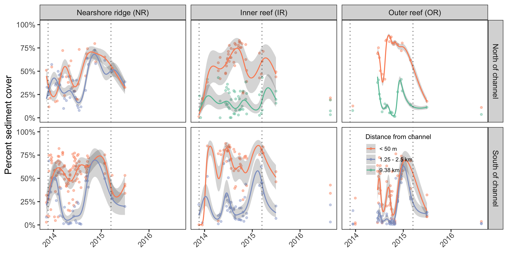
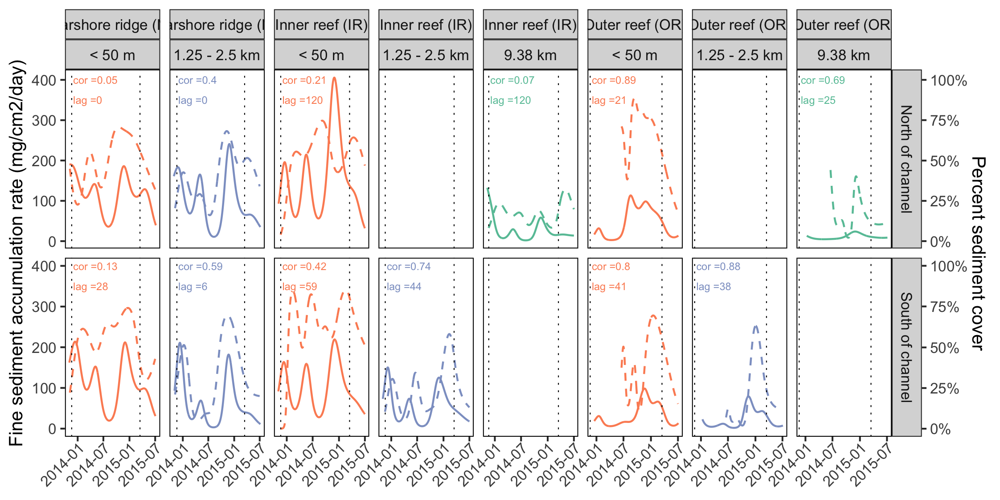
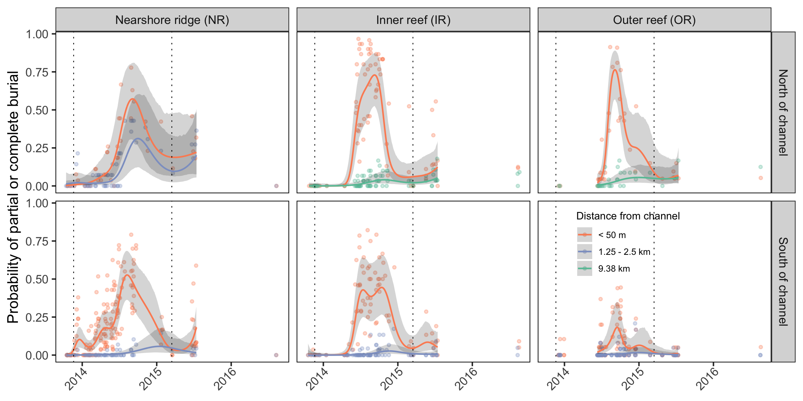
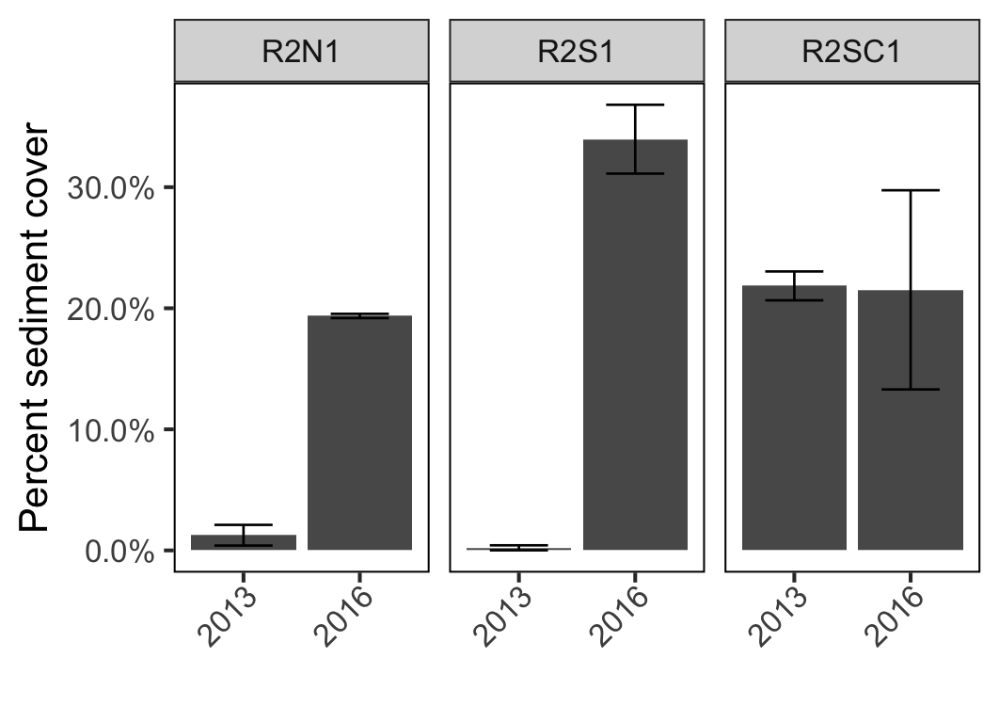
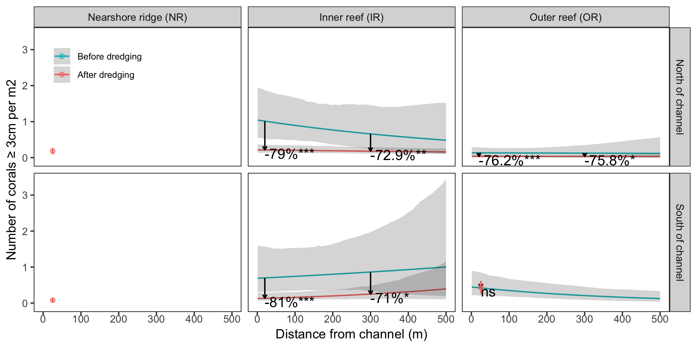
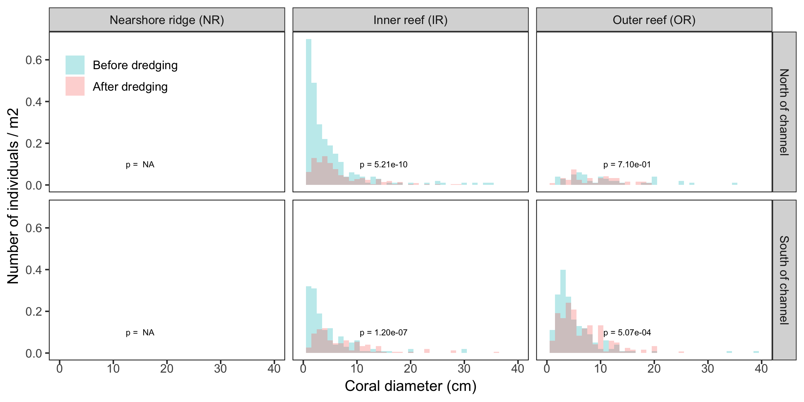

\  
  
#### Ross Cunning^1,2,^*, Rachel N. Silverstein^3^, Brian B. Barnes^4^, Andrew C. Baker^1^

\  

^1^ Department of Marine Biology and Ecology, Rosenstiel School of Marine and Atmospheric Science, University of Miami, 4600 Rickenbacker Causeway, Miami, FL 33149, USA  
^2^ Daniel P. Haerther Center for Conservation and Research, John G. Shedd Aquarium, 1200 South Lake Shore Drive, Chicago, IL 60605, USA  
^3^ Miami Waterkeeper, 2103 Coral Way, 2^nd^ Floor, Miami, FL 33145, USA  
^4^ College of Marine Science, University of South Florida, 140 7^th^ Avenue South, MSL119, St. Petersburg, FL 33701, USA  
* Correspondence: ross.cunning@gmail.com, rachel@miamiwaterkeeper.org


******

```{r setup, include = FALSE}
knitr::opts_chunk$set(echo = FALSE, warning = FALSE, message = FALSE)
```


# Supplementary Material

\  

```{r FigS1, fig.height = 3.74016, fig.width = 7.4801}

```

**Figure S1. Percent sediment cover at each monitoring area during dredging operations.** Points indicate the mean percent sediment cover for each transect measured by CPCe analysis, and smooth lines show GAMM fits for each monitoring area (±84% CI). Fitted lines are colored by distance from channel. Vertical dotted lines indicate the beginning (2013-11-20) and end (2015-03-16) of dredging operations.

*Figure S1 is the same as Figure 5 with the time axis extended to show 2016 data points.*

\  


```{r FIGS2, fig.height = 3.74016, fig.width = 10}

```

**Figure S2. Correlation between fine sediment deposition rates and benthic sediment cover during dredging operations at each monitoring area.** The left y-axis and solid lines correspond to the fine sediment deposition rate (see Fig. S1), while the right y-axis and dotted lines correspond to percent sediment cover (see Fig. 2), with separate panels for each monitoring area. The coefficient of correlation between the two time series is displayed in each panel, along with the lag time (of cover following deposition) for which the highest correlation is observed (up to 120 days). Colors correspond to distance from channel. Blank panels are combinations of reef, direction, and distance for which monitoring data do not exist. Vertical dotted lines indicate the beginning (2013-11-20) and end (2015-03-16) of dredging operations.

*Figure S2 presents the same data from Figures 3 and 5, analyzed and visualized together to show their correlation.*

\  


```{r FIGS3, fig.height = 3.74016, fig.width = 7.4801}

```

**Figure S3. Probability of partial or complete coral burial by sediments in each monitoring area during dredging operations.** Points indicate the proportion of living tagged corals in each monitoring area observed on a given date with the condition codes PBUR (partial burial) or BUR (complete burial). Lines represent GAMM fits for each monitoring area (±84% CI) colored by distance from channel. Vertical dotted lines indicate the beginning (2013-11-20) and end (2015-03-16) of dredging operations.

*Figure S3 is the same as Figure 6, but with the time axis extended to show the 2016 data points.*

\ 


```{r FIGS4, fig.height = 3.74016, fig.width = 7.4801}

```

**Figure S4. Total mortality of non-disease-susceptible coral species in each monitoring area throughout dredging operations.** Bars indicate the predicted probability (±95% CI) of tagged corals being observed with the condition code PM (partial mortality due to sedimentation) at any point through March 2015 (the final month of dredging operations). Bar colors correspond to distance from channel, and empty spaces indicate areas that were not monitored.

\  


```{r FIGS5, fig.height = 3.74016, fig.width = 7.4801}

```

**Figure S5. Percent cover before (2013) and after dredging (2016) at the three permanent monitoring sites for which both before and after data were collected.** Bars indicate the mean percent sediment based on CPCe analysis, and error bars represent standard deviation.

\ 


```{r FigS6, fig.height = 3.74016, fig.width = 7.4801}
knitr::include_graphics("../figures/FigS6.png")
```

**Figure S6. Density of non-disease-susceptible corals ≥3cm within 500m from the channel in each monitoring region before and after dredging operations.** Data 'before' dredging were collected in 2010 and 2013, and data after dredging were collected in 2016-2017. GLMM fits are shown as lines for the regions and times in which data were collected at >2 points beyond 50m, and otherwise as points including only data from within 50m of the channel. Shaded regions and error bars represent 84% CI's. Text annotations indicate the results of tests for differences between timepoints at 20m and 300m from the channel (*** = p < 0.0001; ns = not significantly different).

\ 


```{r FigS7, fig.height = 3.74016, fig.width = 7.4801}

```

**Figure S7. Density of non-disease-susceptible small corals (1-2cm) within 500m from the channel in each monitoring region before and after dredging operations.** Data 'before' dredging were collected in 2010, and data after dredging were collected in 2016-2017. GLMM fits are shown as lines for the regions and times in which data were collected at >2 points beyond 50m. Shaded regions and error bars represent 84% CI's. Text annotations indicate the results of tests for differences between timepoints at 20m and 300m from the channel (. = p < 0.1; * = p < 0.05; ns = not significantly different).

\  


```{r FigS8, fig.height = 3.74016, fig.width = 7.4801}

```

**Figure S8. Size frequency distribution of corals before and after dredging.** For the northern and southern middle and outer reefs, histograms show the relative proportion of corals within 100m of the channel with a given maximum diameter. P-values on each panel are based on a Kruskal-Wallis test for a difference in mean diameter between the two timepoints.

\ 


