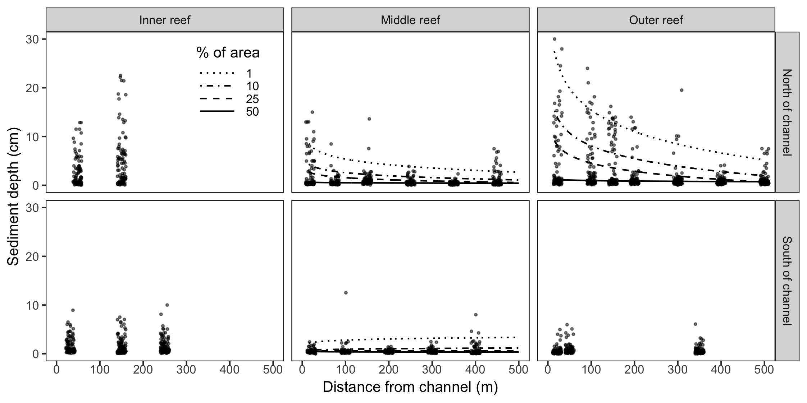

```{r setup, include=FALSE}
knitr::opts_chunk$set(echo = FALSE, warning = FALSE, message = FALSE)

# Load packages

library(janitor)
library(lubridate)
library(furrr)
library(gamm4)
library(MASS)
library(zoo)
library(cowplot)
library(tidyverse)
library(deming)


# Define start and end of dredging (for plotting)
dredge.start.date <- as.Date("2013-11-20")                # NOAA sediment report April 2016, page 44
dredge.end.date <- as.Date("2015-03-16")                  # DCA report August 2015, page 3

## ggplot theme
theme_custom <- function() {
  theme_bw(base_size = 10, base_family = "Arial") %+replace%
    theme(
      panel.grid.major = element_blank(), 
      panel.grid.minor = element_blank(), 
      panel.background = element_blank(),
      panel.border = element_rect(color = "black", fill = NA),
      legend.background = element_rect(fill = NA, colour = NA),
      axis.text.x = element_text(angle=45, hjust=1, vjust = 1)
    )
}

## ggplot labeller
reefnames <- c(
  HB = "Nearshore ridge (NR)",
  R2 = "Inner reef (IR)",
  R3 = "Outer reef (OR)"
)

dirnames <- c(
  N = "North of channel",
  S = "South of channel"
)

distcatnames <- c(
  `1.25 - 2.5 km` = "1.25 - 2.5 km",
  `< 50 m` = "< 50 m",
  `9.38 km` = "9.38 km"
)

global_labeller <- labeller(
  reef = reefnames,
  dir = dirnames,
  dist_cat = distcatnames,
  .default = label_both
)

# Function to add distance category for each area
add_dist_cat <- function(x) {
  x %>% 
    mutate(dist_cat = factor(case_when(
      channel == "channelside" ~ "< 50 m",
      reef == "HB" & channel == "control" ~ "1.25 - 2.5 km",
      reef %in% c("R2", "R3") & channel == "control" & dir == "S" ~ "1.25 - 2.5 km",
      reef %in% c("R2", "R3") & channel == "control" & dir == "N" ~ "9.38 km")))
}

# Plan for parallel processing
plan(multiprocess)


line2user <- function(line, side) {
  lh <- par('cin')[2] * par('cex') * par('lheight')
  x_off <- diff(grconvertX(0:1, 'inches', 'user'))
  y_off <- diff(grconvertY(0:1, 'inches', 'user'))
  switch(side,
         `1` = par('usr')[3] - line * y_off * lh,
         `2` = par('usr')[1] - line * x_off * lh,
         `3` = par('usr')[4] + line * y_off * lh,
         `4` = par('usr')[2] + line * x_off * lh,
         stop("side must be 1, 2, 3, or 4", call.=FALSE))
}
```

# Import datasets from 12 areas
```{r}
# Plume presence
load("data/processed/plume.RData")
fitplume <- gamm.fits %>%
  group_by(reef, dir, channel) %>%
  summarise(mean.plumefit = mean(fit))

plume <- plume.summ %>%
  mutate(plumeprob = pct) %>%
  select(reef, dir, channel, plumeprob) %>%
  full_join(fitplume)

# Fine sediment deposition
load("data/processed/sed_deposited.RData")
depo <- fine.depo
depo <- depo %>%
  rename(int_finedepo = int_fit) %>%
  select(reef, dir, channel, int_finedepo) %>%
  mutate(int_finedepo = int_finedepo / 100)

# Total sediment deposition
#load("data/processed/totalsed_deposited.RData")
#depo <- totalsed.depo
#depo <- depo %>%
#  rename(int_finedepo = int_fit) %>%
#  select(reef, dir, channel, int_finedepo) %>%
#  mutate(int_finedepo = int_finedepo / 100)

# Sediment cover
load("data/processed/sedcov.gamms.RData")
# FILTER TO INCLUDE DATES FOR WHICH FITTED VALUES EXIST FOR ALL SITES (ONLY FULLY COMPARABLE TIME INTERVALS)....
dates1 <- gamms.reef.dir.fits %>%
  filter(date > dredge.start.date, date < dredge.end.date) %>%
  group_by(reef, dir, channel) %>%
  summarise(d = list(unique(as.Date(date))))
dates_all <- zoo::as.Date.numeric(Reduce(intersect, dates1$d))
sandcov <- gamms.reef.dir.fits %>%
  filter(date %in% dates_all) %>%
  group_by(reef, dir, channel) %>%
  summarise(mean_sandcov = mean(fit)) %>%
  select(reef, dir, channel, mean_sandcov)

# Sediment stress / coral burial
load("data/processed/sedstress_gamms.RData")
# FILTER TO INCLUDE DATES FOR WHICH FITTED VALUES EXIST FOR ALL SITES (ONLY FULLY COMPARABLE TIME INTERVALS)....
dates2 <- gamms2.fitted %>%
  filter(date > dredge.start.date, date < dredge.end.date) %>%
  group_by(reef, dir, channel) %>%
  summarise(d = list(unique(as.Date(date))))
dates_all2 <- zoo::as.Date.numeric(Reduce(intersect, dates2$d))
stress <- gamms2.fitted %>%
  group_by(reef, dir, channel) %>%
  filter(date %in% dates_all2) %>%
  summarise(mean_sedstress = mean(fit)) %>%
  select(reef, dir, channel, mean_sedstress)

# Partial mortality
load("data/processed/pm.lsm.RData")
pmort <- as_tibble(summary(pm.lsm1)) %>%
  rename(pmort = prob) %>%
  select(reef, dir, channel, pmort)


# Join all response variables together into df and add site names/labels
df <- list(plume, depo, sandcov, stress, pmort) %>% 
  reduce(left_join, by = c("reef", "dir", "channel")) %>% 
  ungroup()

df <- df %>% add_dist_cat() %>%
  mutate(reef2 = case_when(reef == "HB" ~ "IR", reef == "R2" ~ "MR", reef == "R3" ~ "OR"),
           lab = paste(dir, reef2, sep = ""))


```

# Model responses as a function of plume from 12 areas
```{r}
mod.finedepo  <- lm(int_finedepo ~ plumeprob, data = df)
mod.sandcov   <- lm(mean_sandcov ~ plumeprob, data = df)
mod.sedstress <- lm(mean_sedstress ~ plumeprob, data = df)
mod.pmort <- lm(pmort ~ plumeprob, data = df)
```

# Get plume data from new areas
```{r}
plume <- readxl::read_excel(path = "data/plume/plume_presence_absence_transects.xlsx", sheet = "plume presence-absence") %>%
  gather(site, plume, -date) %>%
  mutate(site = as_factor(site),
         date = as_date(date),
         plume = as.logical(plume),
         reef = str_sub(site, 1, 2),
         siteno  = as.numeric(str_sub(site, 3, 5))) %>%
  filter(date > dredge.start.date, date < dredge.end.date)

# Summarize plume presence
plume.summ <- plume %>%
  group_by(site, reef, siteno) %>%
  summarise(nobs = n(), nyes = sum(plume), nno = nobs - nyes, pct = nyes / nobs) %>%
  ungroup()

plume.summ <- plume.summ %>% 
  rename(plumeprob = pct) %>%
  select(site, reef, siteno, plumeprob)

# Convert site ID to meters from channel
plume.summ <- plume.summ %>%
  mutate(dist = case_when(reef == "IR" ~ (siteno - 70.3) * 0.250,
                          reef == "MR" ~ (siteno - 71.664) * 0.250,
                          reef == "OR" ~ (siteno - 73.16) * 0.250))
```

# Predict partial mortality based on plume in new areas
```{r, include = FALSE}
resdf <- plume.summ %>%
  mutate(finedepo = predict(object = mod.finedepo, newdata = plume.summ),
         sandcov =  predict(object = mod.sandcov, newdata = plume.summ),
         sedstress = predict(object = mod.sedstress, newdata = plume.summ),
         pmort    = predict(object = mod.pmort, newdata = plume.summ))


fig.plumeprob <- ggplot(resdf, aes(x = dist, y = plumeprob)) +
  facet_wrap(~ reef) +
  geom_line() +
  theme(axis.title = element_text(size = 10)) +
  labs(x = "Distance from channel (km)",
       y = "Frequency of\nplume presence")

fig.finedepo <- ggplot(resdf, aes(x = dist, y = finedepo)) +
  facet_wrap(~ reef) +
  geom_line() +
  geom_hline(yintercept = 100, linetype = 2) +
  theme(axis.title = element_text(size = 10)) +
  labs(x = "Distance from channel (km)",
       y = "Predicted total fine\nsediment deposition (kg / m2)")

fig.sandcov <- ggplot(resdf, aes(x = dist, y = sandcov)) +
  facet_wrap(~ reef) +
  geom_line() +
  geom_hline(yintercept = 0.25, linetype = 2) +
  theme(axis.title = element_text(size = 10)) +
  labs(x = "Distance from channel (km)",
       y = "Predicted mean\nsediment cover")

fig.burial <- ggplot(resdf, aes(x = dist, y = sedstress)) +
  facet_wrap(~ reef) +
  geom_line() +
  theme(axis.title = element_text(size = 10)) +
  labs(x = "Distance from channel (km)",
       y = "Predicted mean\ncoral burial")

fig.pmort <- ggplot(resdf, aes(x = dist, y = pmort)) +
  facet_wrap(~ reef) +
  geom_line() +
  geom_hline(yintercept = 0.25, linetype = 2) +
  theme(axis.title = element_text(size = 10)) +
  labs(x = "Distance from channel (km)",
       y = "Predicted proportion\npartial mortality")


plot_grid(fig.plumeprob, fig.finedepo, fig.sandcov, fig.pmort, ncol = 1)
```

# Plot metrics with multiple axes

```{r}
ascale <- function(x, model, d) round(predict(model, newdata = data.frame(plumeprob = x)), d)


png(filename = "figures/Fig9.png", width = 190, height = 95, units = "mm", res = 300)

par(mar = c(2.5, 2.6, 2, 11), mgp = c(1.25, -0.1, 0), tcl = 0.3, cex.axis = 0.8)

plot(plumeprob ~ dist, data = subset(resdf, reef == "IR"),
     axes = F, yaxt= 'n', bty = 'n', type = "l",
     xlab = "< South      Distance from channel (km)     North >", 
     ylab = "Dredge plume presence",
     xlim = c(-15, 15),
     ylim = c(0, 0.7))
axis(1, at = axTicks(1), labels = abs(axTicks(1)))
ymin <- par("usr")[3]
ymax <- par("usr")[4]
yticks <- seq(round(ymin, 1), round(ymax, 1), by = 0.1)
axis(2, at = yticks)
axis(4, line = 0, at = yticks, labels = ascale(yticks, mod.finedepo, 0))
tticks <- ascale(yticks, mod.finedepo, 0)
relticks <- ecdf(seq(min(tticks), max(tticks), 0.01))(tticks[1] * c(2, 4, 9)) * max(yticks)
axis(4, line = 0, at = relticks, labels = c("2x", "4x", "9x"), tcl = 0.6, padj = -3, 
     lwd = 0, lwd.ticks = 1, lty = 1)    # Add relative ticks
mtext(4, line = 1, text = "Fine sediment input (kg/m2)")
axis(4, line = 4, at = yticks, labels = ascale(yticks, mod.sandcov, 2))
tticks <- ascale(yticks, mod.sandcov, 2)
relticks <- ecdf(seq(min(tticks), max(tticks), 0.0001))(tticks[1] * c(2, 4)) * max(yticks)
axis(4, line = 4, at = relticks, labels = c("2x", "4x"), tcl = 0.6, padj = -3,
     lwd = 0, lwd.ticks = 1)    # Add relative ticks
mtext(4, line = 5, text = "Mean daily sediment cover")
axis(4, line = 8, at = yticks, labels = ascale(yticks, mod.pmort, 2))
tticks <- ascale(yticks, mod.pmort, 2)
relticks <- ecdf(seq(min(tticks), max(tticks), 0.0001))(tticks[1] * c(2, 5, 10, 12)) * max(yticks)
axis(4, line = 8, at = relticks, labels = c("2x", "5x", "10x", "12x"), tcl = 0.6, padj = -3,
     lwd = 0, lwd.ticks = 1)    # Add relative ticks
mtext(4, line = 9, text = "Coral partial mortality")
lines(plumeprob ~ dist, data = subset(resdf, reef == "MR"), col = "red")
lines(plumeprob ~ dist, data = subset(resdf, reef == "OR"), col = "blue")
legend(x = -16, y = 0.84, legend = c("Nearshore Ridge (NR)", "Inner Reef (IR)", "Outer Reef (OR)"), 
       lty = 1, col = c("black", "red", "blue"), bty = "n", xpd = NA)
text(x = 22, y = 0.78, labels = "Predicted impacts", xpd = NA)
abline(v = 0, lty = 2)
# abline(v = 1, lty = 3)
# abline(v = 2, lty = 3)
# abline(v = 5, lty = 3)
# abline(v = 10, lty = 3)
dev.off()


```

# Alternative version of figure with axes starting at zero
```{r, eval = F}
ascale2 <- function(x, model, d) round(predict(model, newdata = data.frame(plumeprob = x)) - coef(model)[1], d)

png(filename = "figures/Fig9alt.png", width = 190, height = 95, units = "mm", res = 300)

par(mar = c(2.5, 2.6, 2, 11), mgp = c(1.25, -0.1, 0), tcl = 0.3, cex.axis = 0.8)

plot(plumeprob ~ dist, data = subset(resdf, reef == "IR"),
     axes = F, yaxt= 'n', bty = 'n', type = "l",
     xlab = "< South      Distance from channel (km)     North >", 
     ylab = "Dredge plume presence",
     xlim = c(-15, 15),
     ylim = c(0, 0.7))
axis(1, at = axTicks(1), labels = abs(axTicks(1)))
ymin <- par("usr")[3]
ymax <- par("usr")[4]
yticks <- seq(round(ymin, 1), round(ymax, 1), by = 0.1)
axis(2, at = yticks)
axis(4, line = 0, at = yticks, labels = ascale2(yticks, mod.finedepo, 0))
mtext(4, line = 1, text = "Fine sediment trap accumulation (kg/m2)")
axis(4, line = 4, at = yticks, labels = ascale2(yticks, mod.sandcov, 2))
mtext(4, line = 5, text = "Mean daily sediment cover")
axis(4, line = 8, at = yticks, labels = ascale2(yticks, mod.pmort, 2))
mtext(4, line = 9, text = "Coral partial mortality")
lines(plumeprob ~ dist, data = subset(resdf, reef == "MR"), col = "red")
lines(plumeprob ~ dist, data = subset(resdf, reef == "OR"), col = "blue")
legend(x = -16, y = 0.84, legend = c("Nearshore Ridge (NR)", "Inner Reef (IR)", "Outer Reef (OR)"), 
       lty = 1, col = c("black", "red", "blue"), bty = "n", xpd = NA)
text(x = 18.5, y = 0.78, labels = "Predicted impacts attributable to dredging", xpd = NA)
abline(v = 0, lty = 2)

dev.off()

knitr::include_graphics("../figures/Fig9alt.png")
```

# Reported metrics
```{r}
resdf %>%
  group_by(reef, dist > 0) %>%
  summarise(max(abs(dist)[finedepo > 100]))

resdf %>%
  group_by(reef, dist > 0) %>%
  summarise(max(abs(dist)[sandcov > 0.25]))

resdf %>%
  group_by(reef, dist > 0) %>%
  summarise(max(abs(dist)[pmort > 0.25]))

```

