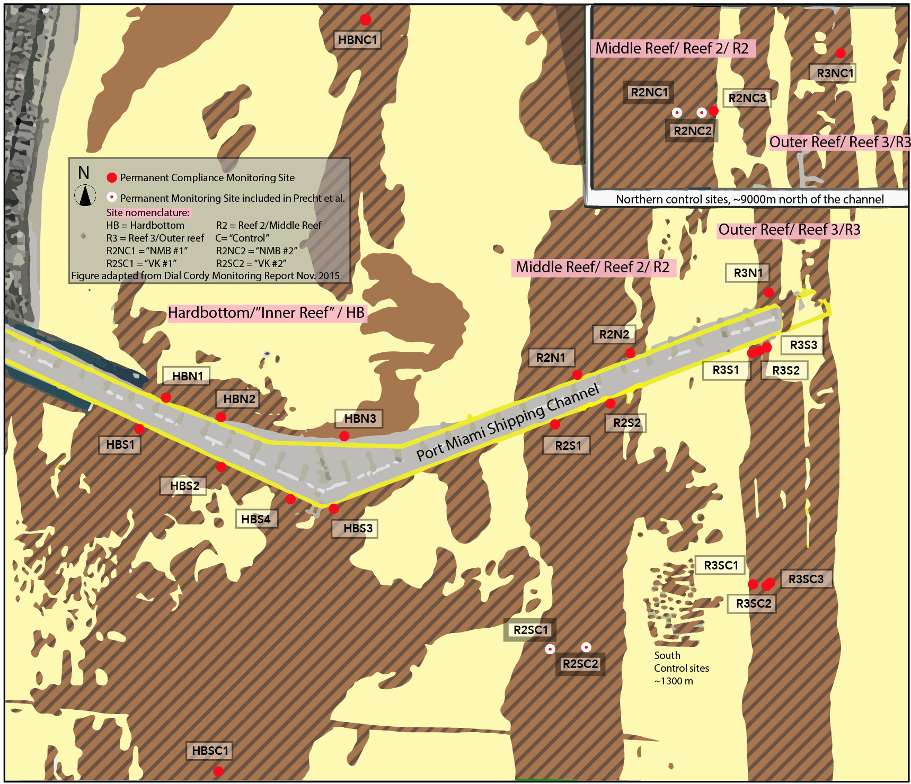

# Introduction

This document attempts to replicate results presented in Precht et al. (2016) [*Scientific Reports*, (doi:10.1038/srep31374)](http://doi.org/10.1038/srep31374) using the dataset provided to us by the authors [(POM_R2_ControlData_Baseline_Post_construction.xlsx)](POM_R2_ControlData_Baseline_Post_construction.xlsx) upon request on March 8, 2018. After importing the data, we proceed line by line through Precht et al.'s 'Tagged-coral colonies' results section, with block quotes taken directly from their paper, followed by our attempt to reproduce results reported in Precht. et al. For full transparency and reproducibility, this document contains the R code we used in each attempt to reproduce reported results, along with our associated R outputs in the form of figures and/or tables. Finally, we describe and explain the outcome of our attempts to reproduce each of Precht et al.'s reported findings.

In short, we are unable to reproduce many of Precht et al.'s findings, particularly with respect to disease prevalence. The authors define disease prevalence in the Methods section as “...the proportion of cases that were present in the population, at a given time.” However, after follow-up communications with the authors, we now understand that the reported disease prevalence values actually represent a cumulative total of: 1) corals observed with active white plague disease (“WP” condition code), 2) dead corals that were observed with white plague disease some time in the past, and 3) dead corals that were assumed to have died from white plague but were never actually observed with the disease. The latter assumption was made based on a set of criteria that are not clearly described in the Methods[^1], and were not reflected in the data provided to us[^a]. It is also not made clear in the Methods that dead corals are counted in estimates of ongoing "disease prevalence." The description of "disease prevalence" in the Methods section is contradictory, vague, and obfuscated by the Results section that refers to disease prevalence results as, corals “infected with white plague” or “show[ing] outward signs of white plague.”

[^a]: An additional summary spreadsheet [(Copy of R2_Ctrls_PCWK4_Verify.xlsx)](Copy of R2_Ctrls_PCWK4_Verify.xlsx) indicating which additional corals were assumed to have died from disease was subsequently provided to us on April 4, 2018.

[^1]: In the tagged-coral colonies Methods section, the authors state “...in cases where corals had died, we were generally able to discern the exact cause of mortality by carefully evaluating the sequence of events recorded (and photographed), prior to death.” It is not clear what this method actually entails, whether criteria were consistently applied, or whether dead corals were included in total reported disease prevalence on a given date. In communications with us, authors described their method of attributing white plague as the cause of mortality without directly observing the disease on colonies in our follow-up communications as follows: “All corals that were included in the accounting of the effects of WP disease that were not directly observed with active disease were included if: 1) the coral was a WP susceptible species, 2) total colony mortality occurred during the WP disease epidemic timeframe, 3) WP was active and killing susceptible corals at the survey site, and 4) no other obvious signs or causes of mortality (i.e. competition, white band disease, black band, etc.) were noted.” (via email attachment [Response to Sci Rep questions from RS.pdf](Response to Sci Rep questions from RS.pdf) on April 4, 2018). These criteria are not described in the paper, the data does not appear in the dataset provided, and therefore it is irreproducible.

[^2]: The “timed swim” data, by contrast, separates out active disease and colonies found dead.

##### Background on data and sampling design

Precht et al. 2016 includes observations of coral condition from both timed swims and tagged corals. The tagged coral data are the focus of our analysis, as they were collected as a part of a FDEP permit-mandated compliance monitoring connected to the Port of Miami expansion project, which involved a large-scale dredging project offshore from October 2013 through March 2015[^3]. Observations reported in Precht et al. span the entire course of the active dredging, ending a few months after dredging concluded in July 2015[^4].  Four of five authors of Precht et al. are also employees of Dial Cordy and Associates, subcontractors of the dredging company Great Lakes Dredge and Dock, which conducted this compliance monitoring[^5].This affiliation, which represents a significant potential conflict of interest, is not disclosed.

Compliance monitoring was triggered whenever dredging activity was within 750m of the channel-side monitoring locations. There were a total of 26 tagged coral monitoring locations located north and south of the shipping channel and sites near the channel (within 100 ft) and far from the channel at paired “control” sites (ranging from ~1300m to the south, to ~8000m to the north, See Figure 1). Reef areas monitored included hardbottom areas (closest inshore, “inner reef”), the middle reef, and the outer reef areas (together these reefs comprise the “Florida Reef Tract” in this area). However, Precht et al. only report data from 2 control sites on the northern middle reef and 2 control sites on the southern middle reef, which represent only 4 of the 26 permanent monitoring stations for which these authors had tagged coral data. Precht et al. does not include data from any outer reef or inner reef “hardbottom” sites, or any sites near the shipping channel where dredging was occurring. Authors do not mention the existence of additional tagged coral data in Precht et al. 

Data issues that we have identified in this study are described in detail below. Please note that we conduct this review using the dataset provided by Precht et al. authors, and we did not independently verify the data through analysis of the photographs of each coral, nor do we present a complete reinterpretation of the data here.

[^3]: The only oblique reference to the dredging project is in the Methods section, which states, “These four sites were originally designed as controls for environmental compliance monitoring associated with the Port Miami deepening project (Fig. 1).”

[^4]: Authors do not make clear that a large-scale dredging project was going on nearby their monitoring locations, nor do they describe the severe dredging-related impact to area corals captured in their compliance monitoring, nor do they explore whether any relationship exists between the dredging and the disease outbreak (despite other studies showing just such a link). Failing to include the data from the near-dredging locations also prevents others from exploring these alternative hypotheses.

[^5]: Authors reference Great Lakes Dredge and Dock in their acknowledgements, but fail to make the appropriate disclosures regarding their relationship in the competing financial interest section.



# Attachments

###Letter to the Editors of Scientific Reports
This document also accompanies our letter to the editors of Scientific Reports: [Letter_to_SciRep_Editors_re_Precht_et_al_RS_RC_AB.pdf](Letter_to_SciRep_Editors_re_Precht_et_al_RS_RC_AB.pdf).


###Data provided by Precht et al. authors upon our request:
#####*These data have not been modified during the process of our review.*

1. [POM_R2_ControlData_Baseline_Post_construction.xlsx](POM_R2_ControlData_Baseline_Post_construction.xlsx)
2. [Copy of Conflicting Coral IDs verified.xlsx](Copy of Conflicting Coral IDs verified.xlsx)
3. [Copy of R2_Ctrls_PCWK4_Verify.xlsx](Copy of R2_Ctrls_PCWK4_Verify.xlsx)
4. [Copy of WP_and_Mortality for week7_7_2015.xlsx](Copy of WP_and_Mortality for week7_7_2015.xlsx)
5. [Precht DCA Coral ID SBOU vs SINT.pdf](Precht DCA Coral ID SBOU vs SINT.pdf)

###Our analysis of species ID conflicts in Precht et al.'s tagged coral data:
6. [precht_spp_conflicts.txt](precht_spp_conflicts.txt)

###Our correspondence with Precht et al. authors to our inquiries about data issues:
#####*All correspondence is unmodified from the original text recieved from Precht et al. authors. Questions posed by us are highlighted in yellow. Responses from Precht et al. follow in subsequent unhighlighted text.*
7. [Response to Sci Rep questions from RS.pdf](Response to Sci Rep questions from RS.pdf)
8. [Response to Rachel Silverstein - Part 2 (WFP & BEG 4.20.18).pdf](Response to Rachel Silverstein - Part 2 (WFP & BEG 4.20.18).pdf)

###Data from all middle and outer reef monitoring sites provided to FDEP by Dial Cordy for compliance monitoring
#####*These data were obtained via records requests. Data was compiled and reformatted by us and is presented here:*
9. [allFDEPdatatable.xls](allFDEPdatatable.xls)


```{r setup, include=FALSE}
knitr::opts_chunk$set(echo = TRUE, warning = FALSE, message = FALSE)

# Load packages
library(tidyverse)
library(stringr)
library(lubridate)
library(readxl)
library(janitor)

# Function for accessing data for a specific coral from full dataset
getCoral <- function(d, s, t, c) {
  with(d, d[Site==s & Transect==t & Coral.ID==c, ])
}

# Function for accessing corals with specific condition codes
hasCond <- function(cond, Condition.Codes) {
  unlist(lapply(Condition.Codes, FUN=function(x) any(grepl(cond, x))))
}
```

## 1. Import and organize data provided by Precht et al.
```{r load_scirep_data}
scirep <- read_xlsx("POM_R2_ControlData_Baseline_Post_construction.xlsx")

# Tidy data
names(scirep) <- c("Date", "Week", "Visit", "Transect", "Category", "Species",
                     "Coral.ID", "QAQC", "Condition.Code")
scirep <- scirep %>%
  mutate(Date = as.Date(Date),
         Week = as.factor(Week)) %>%
  separate(Transect, into = c("Site", "Site.2", "Transect")) %>%
  select(Date, Week, Site, Transect, Coral.ID, Species, QAQC, Condition.Code) %>%
  mutate(coral = interaction(Site, Transect, Coral.ID)) %>%
  filter(Species != "Tag not found") %>%
  droplevels()

# Identify corals recorded as WP prior to being recorded as DEAD
wpdead <- scirep %>%
  filter(Condition.Code %in% c("WP", "DEAD")) %>%
  group_by(coral) %>%
  summarise(firstWP = as.character(min(Date[Condition.Code=="WP"], na.rm=T)),
            firstDEAD = as.character(min(Date[Condition.Code=="DEAD"], na.rm=T))) %>%
  drop_na() %>%
  mutate(WPbeforeDEAD = ifelse(as.Date(firstDEAD) > as.Date(firstWP), TRUE, FALSE))

# For these corals recorded as WP prior to DEAD, change DEAD to WPDEAD
wpdead2 <- scirep %>%
  filter(coral %in% wpdead$coral,
         Condition.Code=="DEAD") %>%
  mutate(Condition.Code="WPDEAD")

scirep <- bind_rows(scirep, wpdead2)

# Merge condition codes
scirep <- with(scirep, {
  aggregate(data.frame(Condition.Codes=Condition.Code), 
            by=list(Date=Date, Week=Week, Site=Site, Transect=Transect, 
                    Coral.ID=Coral.ID, Species=Species, coral=coral), 
            FUN=function(x) c(as.character(x)))
})
```

#### 1.1 Identify species ID errors for individual tagged corals

Using the dataset provided by Precht et al. authors, here we verify whether the species IDs associated with each tagged coral are the same across all observations.

```{r check_conflicts}
# How many corals have multiple species assignments? (These corals are indicative of an error in data entry)
sppcalls <- aggregate(data.frame(Species=scirep$Species), list(Site.Transect.CoralID=scirep$coral), 
                      FUN=function(x) unique(c(as.character(x))))

# Save conflicting species assignments to file
capture.output(sppcalls, file="precht_spp_conflicts.txt")

# Count number of corals with multiple species assignments
conflicts <- table(sapply(sppcalls$Species, length) > 1, dnn = list("conflicting"))

knitr::kable(as.data.frame(conflicts, responseName = "n"))
```

Out of 115 tagged corals, 23 have multiple species IDs associated with them across different points in time, indicative of some (unidentifiable) error in data entry. We generated a full list of these conflicting species assignments and it is provided in the attached file: [precht_spp_conflicts.txt](precht_spp_conflicts.txt).

#### 1.2 Change conflicting species assignments to reflect most frequently assigned species

In our present analysis, we attempt to fix these conflicting species assignments by changing species assignments for each coral (defined as unique site-transect-coralID) to the most frequently assigned species for that tagged individual. In response to our inquiry regarding this issue, Precht et al. authors also provided a verification of these species IDs at [Copy of Conflicting Coral IDs verified.xlsx](Copy of Conflicting Coral IDs verified.xlsx).

```{r fix_errors_scirep}
# There are several instances where a given Site-Transect-Coral.ID has multiple spp. assignments...
# Find which name was used most frequently for each Site-Transect-Coral.ID
which.spp <- with(scirep, {
  aggregate(data.frame(Species=Species), by=list(Site=Site, Transect=Transect, Coral.ID=Coral.ID), 
            FUN=function(x) {
              names(table(c(as.character(x))))[which.max(table(c(as.character(x))))]
            })
})

# Reassign all values of Species for each coral to the most frequently used species for a tagged individual
for (i in 1:nrow(which.spp)) {
  scirep[scirep$Site==which.spp[i, "Site"] & 
          scirep$Transect==which.spp[i, "Transect"] &
          scirep$Coral.ID==which.spp[i, "Coral.ID"],
          "Species"] <- which.spp[i, "Species"]
}
```

## 2. Dataset summary

> Precht *et al.*: "A total of 115 coral colonies, representing 13 coral species, were tagged for repeated monitoring at four sites on the inner reef tract in Miami-Dade County (Fig. 1). Coral colonies were monitored at least 40 times between October 19, 2013 and July 13, 2015."

```{r n_tagged} 
# Count number of corals of each individually tagged coral colony was observed at each site
ncorals <- scirep %>%
  distinct(Site, Species, coral) %>%
  count(Site, Species) %>%
  spread(Species, n) %>%
  adorn_totals()
  
knitr::kable(ncorals, caption = "Number of tagged corals")
```

Number of times monitored:  

```{r n_times_monitored, fig.width=4, fig.height=2}
# Count number of times each coral was observed
n_times <- scirep %>%
  group_by(coral) %>%
  summarise(n = nlevels(factor(Date)))

# Plot histogram of times observed
ggplot(n_times, aes(x = n)) + 
  geom_histogram(binwidth = 1) + 
  scale_x_continuous(breaks = seq(30, 50, 1)) +
  labs(x = "Number of times observed", y = "Number of corals")
```

Within the dataset provided, we confirm that 115 coral colonies of 13 different species were monitored. However, we found that individually tagged colonies were monitored between 31 and 45 times each. This is inconsistent with the Precht et al. statement that colonies were observed at least 40 times.

------


## 3. Peak of coral bleaching

> Precht *et al.*: "The peak of coral bleaching was recorded in September 2014. Specifically, the highest recorded bleaching prevalence occurred on September 12, 2014, when 84% (21 of 25 corals surveyed that day) showed signs of coral bleaching (Fig. 2)."

```{r peak_bleaching}
# Quantify "bleaching"" (combining condition codes BL- bleaching, PB- partial bleaching, and/or P- paling) on 9/12/14
scirep %>%
  filter(Date=="2014-09-12") %>%
  summarise(BL = sum(hasCond("^BL$", Condition.Codes)),
            `BL or PB` = sum(hasCond("^PB$|^BL$", Condition.Codes)),
            `BL or PB or P` = sum(hasCond("^PB$|^BL$|^P$", Condition.Codes)),
            `(Total)` = n()) %>%
  gather(key = "Condtion Code", value = "Number of corals") %>%
  mutate(Proportion = `Number of corals` / 25) %>%
  knitr::kable()
```

We are able to reproduce the 84% metric reported in the paper, but only if all corals recorded with the condition codes for “paling” (P), “partial bleaching” (PB), or “bleaching” (BL) are combined together. In the definitions of the condition codes prescribed by FDEP protocols, P (‘paling’) is defined as live tissue with some loss of color, PB (‘partial bleaching’) is defined as “patches of fully bleached or white tissue”, and BL (‘bleaching’) is defined as “live tissue with complete loss of color across the entire colony.” The proportion of true "bleaching" (BL) in the condition code data was 4 corals out of 25 (16%). Partial bleaching (PB) condition code accounts for an additional 3 corals out of 25. The majority of the 84% "bleaching" reported here, therefore, is due to paling alone. Paling is a common seasonal phenomenon that often occurs in late summer and may not be indicative of stress (see e.g. Gates 1990 *Coral Reefs*). Therefore, combining these condition codes to describe “bleaching” is misleading and serves to inflate the apparent bleaching prevalence.

Here, we tally and plot the prevalence of all three of these condition codes over time for the Precht et al. dataset:

```{r peak_bleaching2_scirep, fig.width=10, fig.height=3}
bleaching <- scirep %>%
  group_by(Date) %>%
  summarise(n=n(),
            freq.BL=sum(hasCond("^BL$", Condition.Codes))/n,
            freq.BLorPB=sum(hasCond("^BL$|^PB$", Condition.Codes))/n,
            freq.BLorPBorP=sum(hasCond("^BL$|^PB$|^P$", Condition.Codes))/n)

# Plot frequency of bleaching codes recorded over time            
ggplot(data=bleaching, mapping=aes(x=Date)) + ylab("Frequency") +
  geom_bar(aes(y=freq.BLorPBorP), stat="identity", fill="green") +  # Green is BL, PB, or P
  geom_bar(aes(y=freq.BLorPB), stat="identity", fill="blue") +  # Blue is BL or PB
  geom_bar(aes(y=freq.BL), stat="identity", fill="red") + # Red is BL only
  scale_x_date(date_breaks = "1 month", date_labels = "%b '%y") +
  theme(axis.text.x = element_text(angle = 45, hjust = 1))
```

We find that the maximum prevalence of bleaching indicated by the BL condition code (red) was September 15th (20% of observed colonies), and the maximum prevalence of bleaching and partial bleaching (BL or PB condition codes – blue) was on September 27th (43% of observed colonies). (Green represents the additional proportion of corals recorded as pale (P)).

------

## 4. First signs of white plague disease

> Precht *et al.*: "The first sign of a white-plague disease outbreak (prevalence > 5%) was noticed at the southern monitoring sites, near Virginia Key, on September 26, 2014."

```{r wp_frequency}
# Calculate frequency of WP at each Site on each Date
wp_scirep <- scirep %>%
  group_by(Site, Date) %>%
  summarise(n = n(),
            WP = sum(hasCond("^WP$", Condition.Codes)),
            freq.WP = WP / n)

# What was the frequency of WP at the southern monitoring sites on September 26, 2014?
wp_scirep %>% filter(Date=="2014-09-26") %>% knitr::kable()
```

Using the data provided by Precht et al., we find that the prevalence of white plague disease (“WP”) on Sept. 26, 2014 was not greater than 5% at the southern monitoring sites. Disease prevalence was only 4% at site R2SC2 (N=1 out of 25 corals) and was 0% at R2SC1 (R2SC2 and R2SC1 are the southern monitoring sites referenced in the Precht et al. Results statement above). Neither reached the “5% prevalence” threshold (defined by Precht et al. as representative of an "outbreak") on that date.

In response to our inquiry regarding this discrepancy, the Precht et al. authors responded, "This was a typo and was not caught in the galley stage. The original statement should have read “< 5%” not “> 5%."” This explanation, however, makes little logical sense. **This apparent typographical error fundamentally changes the conclusions of the paper, the abstract, and the contagion-based model presented.** 

The Precht et al. authors' response, confusingly, goes on to support the original ">5% white plague" claim as stated, citing as support: 1) off-transect, untagged corals that were observed informally and without documentation or reference,  2)  multiple colonies at the southern monitoring sites for which WP condition codes were applied retroactively and which are not noted as such in the dataset. (It is not clear if other sites received the same *post hoc* re-examination and additional scoring of WP condition codes.) For Precht et al. authors’ response to our inquiry about this issue, see [Response to Rachel Silverstein - Part 2 (WFP & BEG 4.20.18).pdf](Response to Rachel Silverstein - Part 2 (WFP & BEG 4.20.18).pdf). 

We therefore queried the Precht *et al.* dataset to determine the earliest date that we find white plague disease appears at a >5% prevalence:

```{r first_wp_over5}
# Find earliest Date with WP frequency greater than 5% at each Site
wp_scirep %>%
  group_by(Site) %>%
  summarise(`First WP > 5%` = min(Date[freq.WP > 0.05]),
                          n = n[Date == `First WP > 5%`],
                         WP = WP[Date == `First WP > 5%`],
                    freq.WP = freq.WP[Date == `First WP > 5%`]) %>%
  knitr::kable()
```

In the Precht et al. dataset, we find that the first time >5% white plague prevalence (defined as occurrence of the “WP” condition code) was documented was on October 17, 2014 at R2SC2, when the proportion was 8% (N=2 out of 25 colonies). 

We then queried the FDEP dataset including all middle and outer reef permanent monitoring locations (submitted by the authors working for Dial Cordy as part of compliance monitoring), and we find that the first prevalence >5% WP at a single site was actually on June 27th, 2014 at R3NC1 (the northern control site from the outer reef, see Figure 1), which was omitted from Precht et al. analyses. **This puts the ‘start of the outbreak’ (defined by by the authors’ >5% disease prevalence threshold) months earlier, north of the channel, and before bleaching had yet occurred.**

------

## 5. White plague prevalence and dynamics

> Precht *et al.*: "...by November 18, 15% of the tagged colonies showed outward signs of white-plague disease (Fig. 2)."

```{r wp_2014-11-18}
# How many colonies had WP on November 18th, 2015?
scirep %>%
  filter(Date=="2014-11-18") %>%
  summarise(Date=unique(Date),
            n=n(),
            WP=sum(hasCond("^WP$", Condition.Codes)),
            freq.WP=WP/n) %>%
  knitr::kable()
```

We find that only 6 of 55 colonies (10.9%) observed on November 18th were actually recorded with the WP condition code.

```{r wp_or_dead_2014-11-18}
# How many colonies had WP or were DEAD on November 18th, 2015?
scirep %>%
  filter(Date=="2014-11-18") %>%
  summarise(Date=unique(Date),
            n=n(),
            WPorDEAD=sum(hasCond("^WP$|^WPDEAD$", Condition.Codes)),
            freq.WPorDEAD=WPorDEAD/n) %>%
  knitr::kable()
```

If we also include corals recorded with white plague that had died by November 18 (12.7%, 7 out of 55 colonies observed), we still do not find a 15% disease prevalence. Based on communication with the authors (see [Response to Sci Rep questions from RS.pdf](Response to Sci Rep questions from RS.pdf)), it appears that the remaining discrepancy of 2.3% is due to the authors' inclusion of additional corals that were assumed to have died from WP that do not appear in their initial dataset. Therefore, the reported value does not accurately describe the colonies that “showed outward signs of white plague” on this date.

In their response to us regarding this issue, Precht et al. authors  responded, "We also stated the following in our in our Scientific Reports paper: "Disease prevalence includes colonies with both active signs of white-plague disease and those that were identified as recently killed as a direct result of the disease. The strong coupling between disease prevalence and total coral mortality suggests that disease prevalence was a useful proxy of mortality.". But this statement is in a legend describing timed swim coral data, not tagged coral data. The Tagged Coral Methods' description of "disease prevalence" values are contradictory and obfuscated by the presentation of these findings in the Results section. (While authors provided us with "qa/qc'd" timed swim data on April 4, 2018, we have no way to verify or to double check the timed swim data, since no photos, video, or alternative datasets were provided or are available, and Mr. Precht alone appears to have collected this data.) 

------

> Precht *et al.*: "White-plague disease did not impact the northern monitoring sites (14 km north) until June 2015."

```{r wp_north}
# When was WP first observed at ≥5% prevalence at the northern sites?
wp_scirep %>%
  filter(Site %in% c("R2NC1", "R2NC2")) %>%
  group_by(Site) %>%
  summarise(`First WP > 5%` = min(Date[freq.WP > 0.05]),
                          n = n[Date == `First WP > 5%`],
                         WP = WP[Date == `First WP > 5%`],
                    freq.WP = freq.WP[Date == `First WP > 5%`]) %>%
  knitr::kable()
```

We also find that WP was first observed ≥5% at the northern sites in June 2015 within the dataset provided by Precht et al.  However, analyzing the same tagged corals at the same 4 sites included in Precht et al, but querying the dataset provided by the authors to the FDEP for compliance monitoring, we find that the northern control site (R2NC2) was observed to have a 10% WP prevalence on May 19, 2015. From this comparison, we determined that Precht et al. excludes observations collected from May 2015 in their analysis. Therefore, this study not only excludes certain sites from analysis, but also dates. For the authors’ response to our inquiry about this missing date, see [Response to Rachel Silverstein - Part 2 (WFP & BEG 4.20.18).pdf](Response to Rachel Silverstein - Part 2 (WFP & BEG 4.20.18).pdf)

------

> Precht *et al.*: "During the week of June 17 [2015], 17% of the tagged coral colonies at the northern monitoring sites were infected with white-plague disease."

```{r wp_2015-06-17}
# How many corals at northern sites had WP on June 17, 2015?
scirep %>%
  filter(Site %in% c("R2NC1", "R2NC2"), Date=="2015-06-17") %>%
  summarise(Date=unique(Date),
            n=n(),
            WP=sum(hasCond("^WP$", Condition.Codes)),
            freq.WP=WP/n) %>%
  knitr::kable()
```

We find that, out of 60 corals at the northern monitoring sites, six (10%) were directly observed with active white plague on June 17th, 2015. In order reproduce the 17% prevalence reported here, Precht et al. must have included corals that were found dead and were then assumed to have died from white plague disease, but without direct observation [see footnote 1].
Therefore, this result is not reproducible– almost half of these corals were not actually “infected with white-plague disease” on this date.

------

> Precht *et al.*: "In total, white-plague disease was observed on seven of the 13 coral species identified at the four permanent monitoring sites (Table 1)."

```{r wp_spp}
# How many species were observed to ever have WP?
scirep %>%
  group_by(Species) %>%
  summarise(`WP observed`=any(hasCond("^WP$", Condition.Codes))) %>%
  knitr::kable()
```

Based on the Precht et al. dataset, only six species are shown to have WP at the four permanent monitoring sites. The tagged coral data do not contain any reports of WP for *Colpophyllia natans*, as reported by Precht et al. in their Table 1. Photographs provided by FDEP show that the single tagged *C. natans* colony was indeed diseased on Dec. 12, 2014, but data from this date are excluded from the Precht et al. dataset. Precht et al.'s finding is therefore not reproducible from the dataset provided[^8].

[^8]: Data appear in the dataset from December 12, 2014 but only from R2SC1 location (southern control site). Photographs submitted to FDEP show that corals at R2SC2 were observed on that date but were not recorded in the dataset.

------

> Precht *et al.*: "The highest recorded prevalence of white-plague disease occurred on July 7, 2015, when 40% (22 of 55 corals surveyed that day) showed signs of white-plague disease infection (Fig. 2)."

```{r wp_2015-07-07, fig.width=10, fig.height=3}
# What is prevalence of WP on July 7th, 2015?
scirep %>%
  filter(Date=="2015-07-07") %>%
  summarise(Date=unique(Date), n=n(), 
            WP=sum(hasCond("^WP$", Condition.Codes)), 
            freq.WP=WP/n) %>%
  knitr::kable()

scirep %>%
  filter(Date=="2015-07-07") %>%
  summarise(Date=unique(Date), n=n(), 
            WPorWPDEAD=sum(hasCond("^WP$|^WPDEAD$", Condition.Codes)), 
            freq.WPorWPDEAD=WPorWPDEAD/n) %>%
  knitr::kable()
```

We find that on July 7, 2015, only 3 out of 55 corals observed (5.5%) were actually recorded in the data as “WP”. If we also include corals that were recorded as having WP *and* corals that were previously recorded as having WP and are now recorded as dead (“WPdead”), the total is 15 out of 55 corals, or 27.3%. We are unable to reproduce the result reported in the paper with the provided data. Therefore, the  40% disease prevalence reported by Precht et al. does not represent the number of corals "showing signs of white plague infection" on July 7, 2015, but must acutally represent the cumulative sum of corals that were recorded with WP, that had WP and then died, and/or that were assumed by authors to have died from WP at any time before July 7, 2015 (also the end of the reported data period). 

This is, perhaps, the most dramatic example of how the stated methods for calculating disease prevalence produce different results than the methods actually employed in Precht et al., which systematically overinflate the apparent disease prevalence.

We then queried the Precht et al. dataset to determine the highest recorded prevalence of active white plague (“WP” condition code):

```{r scirep_highest_wp_prevalence, fig.width=10, fig.height=3}
# Graph white plague prevalence by Date (for all corals surveyed - may include multiple sites analyzed by Precht et al.)
scirep_wp_by_date <- scirep %>%
  group_by(Date) %>%
  summarise(n=n(), WP=sum(hasCond("^WP$", Condition.Codes)), freq.WP=WP/n)

ggplot(data=scirep_wp_by_date, aes(x=Date, y=freq.WP)) + ylim(0,0.4) + 
  geom_bar(stat="identity") +
  scale_x_date(date_breaks = "1 month", date_labels = "%b '%y") +
  theme(axis.text.x = element_text(angle = 45, hjust = 1))
```

We found that, of the tagged corals included in Precht et al. directly observed to have white plague disease on a given date, the highest active disease prevalence only ever reaches 15% (9 out of 60 colonies observed on July 5, 2015).

We can also show the cumulative impact of white plague disease by plotting the number of corals with active white plague combined with corals that had previously been observed with white plague disease and are now dead:

```{r, fig.width = 10, fig.height = 3}
# Graph prevalence of WP and WPDEAD
scirep_wporwpdead_by_date <- scirep %>%
  group_by(Date) %>%
  summarise(n=n(), WPorWPDEAD=sum(hasCond("^WP$|^WPDEAD$", Condition.Codes)), 
            freq.WPorWPDEAD=WPorWPDEAD/n)

ggplot(data=scirep_wporwpdead_by_date, aes(x=Date, y=freq.WPorWPDEAD)) + ylim(0,0.4) +
  geom_bar(stat="identity") +
  scale_x_date(date_breaks = "1 month", date_labels = "%b '%y") +
  theme(axis.text.x = element_text(angle = 45, hjust = 1))
```

If we count corals that have active white plague disease (“WP”) *and* corals that previously had WP disease and are now dead (“WPdead”), we find that the highest prevalence on any date is just 15 out of 55 (27.3%) on July 7th, 2015.

------

> Precht *et al.*: "Of the white-plague impacted species, the overall disease prevalence was 51% (35 of 69 corals surveyed)."

```{r wp_freq_sus_spp}
# Susceptible species:
sus <- c("CNAT", "DSTO", "DLAB", "EFAS", "MMEA", "MCAV", "ODIF", "DCLI", "DSTR", "SBOU")

scirep_wp.corals <- scirep %>%
  filter(Species %in% sus) %>%
  group_by(Species, coral) %>%
  summarise(WP=any(hasCond("^WP$", Condition.Codes))) %>%
  select(WP) %>% 
  table() %>%
  addmargins() %>%
  knitr::kable()
```

We find that, analyzing just the species that Precht et al. determined to be white plague susceptible, the dataset provided shows that only 28 out of 69 colonies (40.6%) were recorded as having WP at any point in time (cumulative disease total).

------

## 6. Testing for a relationship between bleaching and disease

------

> Precht *et al.*: "The majority (81%) of white-plague susceptible corals bleached, prior to becoming infected with the disease (Table 1). *Meandrina meandrites*, *Dichocoenia stokesi*, *Colpophyllia natans*, and *Pseudodiploria strigosa* were the most heavily impacted coral species, with 100% of tagged colonies being afflicted with white-plague disease. All colonies that showed signs of disease died, regardless of species."

```{r scirep_bleaching_disease}
# Get list of WP-affected corals
scirep_wp.corals <- scirep %>%
  filter(Species %in% sus) %>%
  group_by(coral) %>%
  summarise(WP=any(hasCond("^WP$", Condition.Codes))) %>%
  filter(WP==TRUE)

# How many WP-affected corals bleached prior to becoming infected?
scirep_bleach_dis <- scirep %>%
  filter(coral %in% scirep_wp.corals$coral) %>%
  group_by(coral) %>%
  summarise(`P date`=min(Date[hasCond("^P$", Condition.Codes)]),
            `PB date`=min(Date[hasCond("^PB$", Condition.Codes)]),
            `BL date`=min(Date[hasCond("^BL$", Condition.Codes)]),
            `WP date`=min(Date[hasCond("^WP$", Condition.Codes)])) %>%
  arrange(`BL date`, `PB date`, `P date`, `WP date`)

# Calculate number of corals with either BL, PB, or P prior to WP
scirep_bleach_dis %>%
  summarise(`n with WP`=n(),
            `BL first`=sum(`BL date` < `WP date`),
            `PB first`=sum(`PB date` < `WP date`),
            `P first`=sum(`P date` < `WP date`)) %>%
  knitr::kable()
```

This is a key finding, yet we cannot reproduce it. We find that only 3 out of 28 corals (10.7%) that had WP were recorded as bleached (BL) at some time prior to becoming infected. 20 out of 28 (71%) were recorded as partially bleached (PB) prior to infection, while 28 out of 28 (100%) were recorded as pale (P) prior to infection. **We cannot combine these three condition codes (as appears to have happened for the earlier report of bleaching prevalence) to replicate the reported 81% prior “bleaching” for WP-infected corals.**

However, to statistically test whether there is a relationship between bleaching and disease, the number of corals that bleached and did *not* get disease must also be considered (which Precht *et al.* authors also did not test). We test for this here:

```{r bleaching_nodisease}
blwp <- scirep %>%
  filter(Species %in% sus) %>%
  group_by(coral) %>%
  summarise(firstPBorBL = min(Date[hasCond("^PB$|^BL$", Condition.Codes)]),
                firstWP = min(Date[hasCond("^WP$", Condition.Codes)])) %>%
  mutate_if(is.Date, function(x) (x - as.Date("2013-10-19")) / ddays(1)) %>%  # convert to days since start
  mutate(firstPBorBL = if_else(is.infinite(firstPBorBL), 999, firstPBorBL),
             firstWP = if_else(is.infinite(firstWP), 999, firstWP)) 

res <- with(blwp, table(WP = firstWP < 999, BLorPB = firstPBorBL < firstWP))
addmargins(res)

fisher.test(res)
```

We do not consider “paling” to be descriptive of bleaching. Therefore, we considered BL and PB only in this analysis. We find that 50 of the 69 disease-susceptible corals ‘bleached’ (BL or PB), and of these, 20 got WP disease (40%), but 30 did not (60%). We find a similar incidence of disease among corals that did not bleach, with 8 out of 19 (42%) having the disease, and 11 (58%) not having disease. **With Fisher’s exact test, we find no relationship between bleaching (BL or PB) and disease (WP) (p-value=1).**

------

## 7. Evaluating the relationship between disease and death
 
> Precht *et al.*: "All colonies that showed signs of disease died, regardless of species."

```{r}
scirep %>%
  group_by(coral) %>%
  summarise(WP = any(hasCond("^WP$", Condition.Codes)),
            DEAD = any(hasCond("^DEAD$", Condition.Codes))) %>%
  count(WP, DEAD) %>%
  knitr::kable()
```

In the Precht et al dataset, we find that 15 coral colonies recorded with WP were still alive on 7/15/15, while 13 corals were dead. **This is a mortality rate of 46%. Therefore, the data do not support the claim of 100% mortality following disease infection.**
